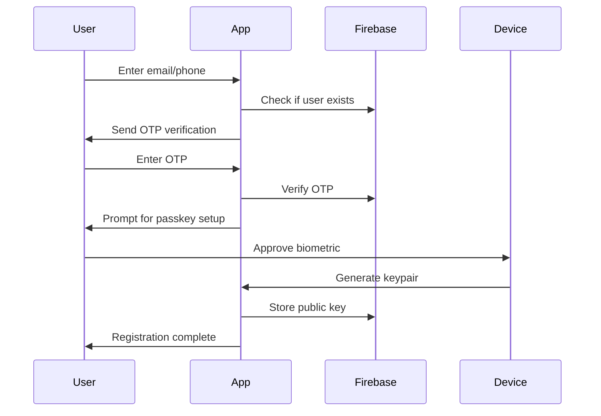
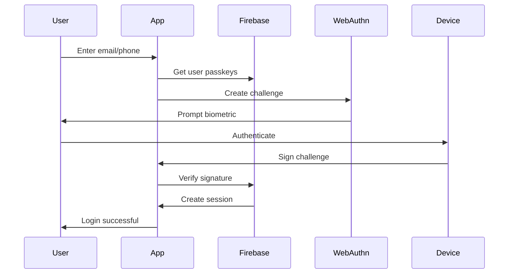

# Product Requirements Document: Passkey + Biometric Authentication
## React MVP Loan App - PSSLAI

---

## 1. Executive Summary

### Product Vision
Enable secure, passwordless authentication for PSSLAI loan app users by leveraging device biometrics (Face ID, Touch ID, fingerprint) through WebAuthn passkeys, providing a seamless and familiar authentication experience that works across mobile PWA and web platforms.

### Key Benefits
- **No passwords to remember** - Reduces support tickets for password resets
- **Higher security** - Device-based cryptographic keys are more secure than passwords
- **Familiar UX** - Users already use Face ID/fingerprint daily on their devices
- **Faster login** - One-tap biometric authentication vs typing credentials
- **Cross-platform** - Works on iOS Safari, Android Chrome, and desktop browsers

### Success Metrics
- 80% of users adopt passkey authentication within 3 months
- 50% reduction in password reset support tickets
- < 2 second average authentication time
- 99.9% authentication success rate for registered passkeys

---

## 2. Functional Requirements

### 2.1 Core Authentication Features

| ID | Requirement | User Story | Acceptance Criteria | Priority |
|----|-------------|------------|-------------------|----------|
| FR001 | Passkey Registration | As a user, I want to register my device with a passkey during signup | - Passkey creation triggers after OTP verification<br>- Device stores private key securely<br>- Public key saved to Firebase | P0 |
| FR002 | Biometric Login (iOS) | As an iPhone user, I want to login with Face ID/Touch ID | - Safari WebAuthn API triggers Face ID<br>- Falls back to device passcode if biometric fails<br>- Works in PWA mode | P0 |
| FR003 | Biometric Login (Android) | As an Android user, I want to login with fingerprint/face | - Chrome WebAuthn triggers biometric prompt<br>- Supports both fingerprint and face unlock<br>- Works in PWA mode | P0 |
| FR004 | Multi-Device Support | As a user, I want to register passkeys on multiple devices | - Max 5 passkeys per account<br>- Device management dashboard<br>- Ability to name devices | P1 |
| FR005 | Fallback Authentication | As a user, I need a fallback if passkey fails | - OTP via SMS as primary fallback<br>- Magic link via email as secondary<br>- Legacy password for transition period | P0 |
| FR006 | PWA Integration | As a mobile user, I want passkeys to work in installed PWA | - WebAuthn works in standalone PWA mode<br>- Seamless experience between browser and PWA | P0 |
| FR007 | Passkey Recovery | As a user, I want to recover access if I lose my device | - Account recovery via OTP + security questions<br>- Admin-assisted recovery for high-value accounts<br>- Recovery generates new passkey | P0 |
| FR008 | Cross-Platform Sync | As a user, I want to use passkeys across Apple/Google ecosystems | - Support iCloud Keychain passkey sync<br>- Support Google Password Manager sync<br>- QR code for cross-platform registration | P2 |

### 2.2 Security Requirements

| ID | Requirement | Description | Implementation |
|----|-------------|-------------|----------------|
| SR001 | Cryptographic Standards | Use industry-standard algorithms | - ES256 (ECDSA with P-256 and SHA-256)<br>- RS256 as fallback |
| SR002 | Anti-Phishing | Prevent credential phishing | - Origin binding via WebAuthn<br>- Domain validation |
| SR003 | Rate Limiting | Prevent brute force attacks | - Max 5 failed attempts per hour<br>- Progressive delays |
| SR004 | Session Management | Secure session handling | - 30-min idle timeout<br>- Secure, httpOnly cookies |
| SR005 | Audit Logging | Track authentication events | - Log all auth attempts<br>- Device fingerprinting |

### 2.3 User Experience Requirements

| ID | Requirement | Description | Design Specs |
|----|-------------|-------------|--------------|
| UX001 | Onboarding Flow | Guide users through passkey setup | - Interactive tutorial<br>- Skip option for later<br>- Progress indicator |
| UX002 | Device Naming | Let users identify their devices | - Auto-detect device type<br>- Custom naming option<br>- Icons for device types |
| UX003 | Error Handling | Clear error messages | - Specific error for each failure type<br>- Actionable recovery steps<br>- Support contact option |
| UX004 | Loading States | Visual feedback during auth | - Biometric animation<br>- Progress indicator<br>- < 100ms perceived delay |

---

## 3. Technical Architecture

### 3.1 Technology Stack

```yaml
Frontend:
  - React 19.1.1 + TypeScript
  - Redux Toolkit (auth state management)
  - Material-UI (UI components)
  - @simplewebauthn/browser (WebAuthn client)
  
Backend:
  - Firebase Auth (user management)
  - Firestore (passkey metadata storage)
  - Cloud Functions (verification endpoints)
  - @simplewebauthn/server (WebAuthn server)

Validation:
  - Zod schemas for all auth payloads
  - React Hook Form for UI forms
```

### 3.2 Data Models

```typescript
// Passkey Credential Schema
interface PasskeyCredential {
  id: string;                    // Credential ID from WebAuthn
  userId: string;                // Firebase user ID
  publicKey: string;             // Base64 encoded public key
  credentialId: string;          // Base64 credential ID
  counter: number;               // Signature counter
  deviceName: string;            // User-friendly device name
  deviceType: 'mobile' | 'desktop' | 'tablet';
  browser: string;               // Chrome, Safari, etc.
  os: string;                    // iOS, Android, Windows, etc.
  createdAt: Timestamp;
  lastUsedAt: Timestamp;
  isActive: boolean;
}

// Authentication Challenge Schema
interface AuthChallenge {
  id: string;
  challenge: string;             // Base64 encoded challenge
  userId?: string;               // For login challenges
  email?: string;                // For registration
  expiresAt: Timestamp;
  type: 'registration' | 'authentication';
}

// User Profile Extension
interface UserProfile {
  // ... existing fields
  passkeyEnabled: boolean;
  passkeys: PasskeyCredential[];
  fallbackMethod: 'otp' | 'email' | 'password';
  securityQuestions?: SecurityQuestion[];
}
```

### 3.3 Authentication Flows

#### Registration Flow


#### Login Flow


---

## 4. Implementation Plan

### Phase 1: Foundation (Week 1-2)
- [ ] Set up WebAuthn dependencies
- [ ] Create Zod schemas for auth entities
- [ ] Build passkey service layer
- [ ] Implement Firebase Cloud Functions for verification
- [ ] Create Redux slices for passkey state

### Phase 2: Registration (Week 2-3)
- [ ] Build passkey registration UI
- [ ] Implement device detection logic
- [ ] Create onboarding flow
- [ ] Add device naming functionality
- [ ] Test on iOS/Android devices

### Phase 3: Authentication (Week 3-4)
- [ ] Build passkey login UI
- [ ] Implement challenge/response flow
- [ ] Add biometric prompts
- [ ] Create fallback mechanisms
- [ ] Session management

### Phase 4: Management (Week 4-5)
- [ ] Device management dashboard
- [ ] Passkey revocation
- [ ] Recovery flows
- [ ] Admin tools
- [ ] Audit logging

### Phase 5: Polish & Testing (Week 5-6)
- [ ] Cross-browser testing
- [ ] PWA testing
- [ ] Security audit
- [ ] Performance optimization
- [ ] Documentation

---

## 5. User Interface Specifications

### 5.1 Mobile-First Login Screen

```typescript
// Components Structure
<PasskeyLoginScreen>
  <Logo />
  <WelcomeText>
    "Welcome back to PSSLAI"
  </WelcomeText>
  
  <EmailPhoneInput 
    placeholder="Email or Mobile Number"
    validation={zodEmailOrPhone}
  />
  
  <ContinueButton>
    Continue with Passkey
  </ContinueButton>
  
  <Divider>OR</Divider>
  
  <FallbackOptions>
    <LinkButton>Use OTP Instead</LinkButton>
    <LinkButton>Use Password</LinkButton>
  </FallbackOptions>
  
  <RegisterPrompt>
    New member? <Link>Sign up</Link>
  </RegisterPrompt>
</PasskeyLoginScreen>
```

### 5.2 Biometric Prompt Designs

```typescript
// iOS Face ID Prompt
interface FaceIDPrompt {
  icon: "face-id-icon.svg";
  title: "Sign in to PSSLAI";
  subtitle: "Use Face ID to continue";
  cancelButton: "Cancel";
  fallbackButton: "Use Passcode";
}

// Android Fingerprint Prompt  
interface FingerprintPrompt {
  icon: "fingerprint-icon.svg";
  title: "Verify your identity";
  subtitle: "Touch the fingerprint sensor";
  cancelButton: "Cancel";
  fallbackButton: "Use PIN";
}
```

### 5.3 Device Management Screen

```typescript
<DeviceManagementScreen>
  <SectionHeader>Your Trusted Devices</SectionHeader>
  
  <DeviceList>
    {devices.map(device => (
      <DeviceCard>
        <DeviceIcon type={device.type} />
        <DeviceInfo>
          <DeviceName>{device.name}</DeviceName>
          <DeviceDetails>
            {device.browser} • {device.os}
          </DeviceDetails>
          <LastUsed>Last used {device.lastUsedAt}</LastUsed>
        </DeviceInfo>
        <RemoveButton onClick={removeDevice} />
      </DeviceCard>
    ))}
  </DeviceList>
  
  <AddDeviceButton>
    + Add New Device
  </AddDeviceButton>
</DeviceManagementScreen>
```

---

## 6. Error Scenarios & Handling

| Scenario | User Message | Recovery Action |
|----------|--------------|-----------------|
| Device doesn't support WebAuthn | "Your device doesn't support passkeys" | Offer OTP/password login |
| Biometric not enrolled | "Please set up Face ID/fingerprint in device settings" | Link to device settings guide |
| Passkey creation fails | "Unable to create passkey. Please try again" | Retry with detailed instructions |
| Authentication timeout | "Authentication timed out" | Restart auth flow |
| Invalid passkey | "This device is not recognized" | Offer to register device |
| Network error | "Connection error. Please check your internet" | Retry with offline detection |
| Too many attempts | "Too many attempts. Try again in X minutes" | Show countdown timer |

---

## 7. Compatibility Matrix

| Platform | Browser | WebAuthn Support | Biometric Type | Notes |
|----------|---------|------------------|----------------|-------|
| iOS 14+ | Safari | ✅ Full | Face ID, Touch ID | Works in PWA |
| iOS 14+ | Chrome | ✅ Full | Face ID, Touch ID | Redirects to Safari |
| Android 9+ | Chrome | ✅ Full | Fingerprint, Face | Native support |
| Android 9+ | Firefox | ⚠️ Partial | Fingerprint only | Limited API |
| Windows 10+ | Edge | ✅ Full | Windows Hello | PIN, Face, Fingerprint |
| Windows 10+ | Chrome | ✅ Full | Windows Hello | Full support |
| macOS 11+ | Safari | ✅ Full | Touch ID | On supported Macs |
| macOS 11+ | Chrome | ✅ Full | Touch ID | Platform authenticator |

---

## 8. Security Considerations

### 8.1 Threat Model
- **Phishing**: Mitigated by origin binding in WebAuthn
- **Device theft**: Requires biometric/PIN to use passkey
- **Man-in-the-middle**: Public key cryptography prevents interception
- **Replay attacks**: Challenge-response with nonce prevents replay
- **Account takeover**: Multi-factor recovery process required

### 8.2 Compliance
- **GDPR**: Biometric data stays on device (not transmitted)
- **PCI DSS**: No payment card data in auth flow
- **SOC 2**: Audit logs for all authentication events
- **FIDO2**: Full compliance with FIDO Alliance standards

---

## 9. Analytics & Monitoring

### 9.1 Key Metrics to Track
```typescript
interface PasskeyMetrics {
  registrationRate: number;        // % users who set up passkey
  adoptionRate: number;             // % logins using passkey
  successRate: number;              // % successful passkey auths
  averageAuthTime: number;          // Time from prompt to success
  fallbackRate: number;             // % using fallback methods
  deviceDistribution: DeviceStats;  // Breakdown by device type
  errorRate: ErrorStats;            // Common failure reasons
}
```

### 9.2 Events to Log
- `passkey_registration_started`
- `passkey_registration_completed`
- `passkey_registration_failed`
- `passkey_login_initiated`
- `passkey_login_succeeded`
- `passkey_login_failed`
- `passkey_removed`
- `fallback_method_used`

---

## 10. Testing Strategy

### 10.1 Unit Tests
- WebAuthn mock for credential creation/verification
- Redux state management for passkeys
- Validation schemas with edge cases
- Error handling scenarios

### 10.2 Integration Tests
- Firebase Functions verification flow
- Cross-browser WebAuthn compatibility
- PWA installation and authentication
- Fallback mechanism triggers

### 10.3 E2E Tests
- Complete registration flow
- Login with existing passkey
- Device management operations
- Recovery scenarios

### 10.4 Manual Testing Checklist
- [ ] iPhone with Face ID
- [ ] iPhone with Touch ID
- [ ] Android with fingerprint
- [ ] Android with face unlock
- [ ] iPad Safari
- [ ] Android tablet Chrome
- [ ] Windows Hello
- [ ] macOS Touch ID
- [ ] PWA on iOS
- [ ] PWA on Android

---

## 11. Migration Strategy

### 11.1 Rollout Plan
1. **Soft Launch (Month 1)**
   - Enable for 10% of new users
   - Collect feedback and metrics
   - Fix critical issues

2. **Gradual Rollout (Month 2-3)**
   - Increase to 50% of new users
   - Prompt existing users to add passkey
   - A/B test onboarding flows

3. **Full Launch (Month 4)**
   - Enable for all users
   - Marketing campaign for adoption
   - Support team training

### 11.2 Backward Compatibility
- Keep password auth for 6 months minimum
- Allow users to toggle between methods
- No forced migration
- Clear communication about benefits

---

## 12. Open Questions & Decisions Needed

### Resolved ✅
1. **Q: When to trigger passkey registration?**
   **A: After OTP verification during signup, with skip option**

2. **Q: How many passkeys per account?**
   **A: Maximum 5 devices, with management dashboard**

3. **Q: Fallback authentication priority?**
   **A: OTP → Email magic link → Password (deprecated)**

### Pending Discussion 🤔
1. **Q: Should we support passkey sharing between family members?**
   - Pro: Convenient for shared accounts
   - Con: Security implications
   - **Recommendation**: Start with individual only, consider later

2. **Q: How long should sessions last after passkey auth?**
   - Options: 30 min, 2 hours, 24 hours, 30 days
   - **Recommendation**: 2 hours active, 30 min idle

3. **Q: Should we require passkey for high-value transactions?**
   - Example: Loan applications over ₱50,000
   - **Recommendation**: Yes, with step-up authentication

4. **Q: Integration with existing SSO providers?**
   - Google, Facebook, Apple Sign-In compatibility
   - **Recommendation**: Phase 2 consideration

---

## 13. Success Criteria

### Launch Criteria
- [ ] 99% success rate in staging environment
- [ ] < 2 second average authentication time
- [ ] Support for 90% of target devices
- [ ] Fallback mechanisms tested and working
- [ ] Security audit passed
- [ ] Documentation complete

### Post-Launch Success Metrics (3 months)
- [ ] 80% of new users adopt passkeys
- [ ] 60% of existing users add passkeys
- [ ] 50% reduction in password reset tickets
- [ ] NPS score > 8 for auth experience
- [ ] Zero security incidents related to passkeys

---

## Appendix A: Technical Resources

- [WebAuthn API Specification](https://www.w3.org/TR/webauthn-2/)
- [SimpleWebAuthn Library](https://simplewebauthn.dev/)
- [Firebase Auth Custom Claims](https://firebase.google.com/docs/auth/admin/custom-claims)
- [FIDO2 Best Practices](https://fidoalliance.org/fido2/)
- [Apple Passkey Documentation](https://developer.apple.com/passkeys/)
- [Google Passkey Documentation](https://developers.google.com/identity/passkeys)

## Appendix B: Competitor Analysis

| App | Passkey Support | Fallback Method | Multi-Device | Notes |
|-----|-----------------|-----------------|--------------|-------|
| PayPal | ✅ Yes | SMS OTP | Yes | Industry leader |
| Revolut | ✅ Yes | Email | Yes | Smooth UX |
| Grab | ⚠️ Partial | PIN | No | Mobile only |
| GCash | ❌ No | MPIN | No | Legacy approach |
| PayMaya | ⚠️ Testing | SMS OTP | No | Beta program |

---

*Document Version: 1.0*
*Last Updated: {{current_date}}*
*Author: PSSLAI Development Team*
*Status: Draft - Pending Review*