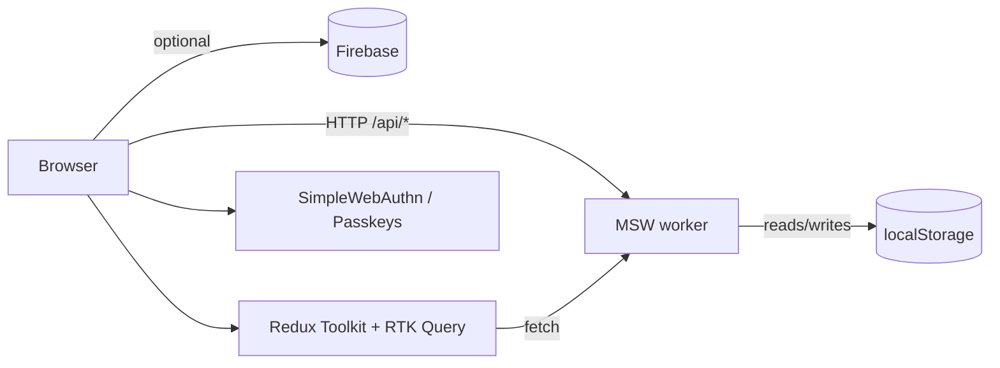

# Architecture

## High-level



The default backend is **MSW**: a service worker intercepts every `/api/*` call and answers from a localStorage-backed in-memory DB seeded with three loans. This makes the public demo zero-config while keeping the wire format identical to a real backend.

When `VITE_BACKEND=firebase` is set, the same RTK Query endpoints can be swapped to call Firestore via the `firebase` adapter. The default Vercel deploy stays in MSW mode.

## Module boundaries

```
src/
├── app/         App shell — providers, error boundary, router
├── features/
│   ├── auth/                  Login, passkey enrollment, AuthContext
│   ├── loan-application/      Multi-step form + Zod schema
│   ├── loan-management/       Dashboard, status updates, notes
│   └── theme/                 Light/dark theme + toggle
├── components/  Shared primitives (TextInput, SelectInput, FileUpload, SummaryCard, ResponsiveLayout, ErrorBoundary)
├── lib/
│   ├── api/                   Contract types
│   ├── msw/                   Handlers + browser/server worker setup
│   ├── firebase/              Optional adapter
│   ├── i18n/                  react-i18next bootstrap + locales
│   └── reportWebVitals.ts
├── store/       RTK store, slices, RTK Query api
├── utils/       Validators, refNumber, constants
└── types/       Shared types
```

Each feature owns its components, hooks, and (optionally) its services. Cross-feature use happens through the feature's barrel `index.ts`.

## Data flow

1. User action in feature component triggers an RTK Query hook (e.g. `useCreateLoanMutation`).
2. RTK Query issues `fetch('/api/loans', { method: 'POST', body })`.
3. MSW intercepts and dispatches to a handler that reads/writes `localStorage`.
4. Response flows back through RTK Query, which invalidates the relevant tag (`Loan/LIST`) and re-fetches downstream queries.

## Authentication

- Static `demo / demo` credentials (form-based) — via MSW `/api/auth/login`.
- Passkeys via SimpleWebAuthn — registration + authentication ceremonies are simulated through MSW. On supported devices the ceremony actually runs against the platform authenticator (Touch ID / Face ID / Windows Hello), but the resulting credential never leaves the browser.

## Build + deploy

- Vite produces static assets in `build/`.
- Vercel deploys `build/` with SPA rewrites (`vercel.json`).
- Production stays in MSW mode; no secrets in deployment.
