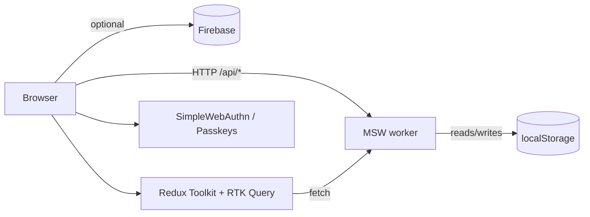

# LoanFlow Pro — Top-Tier Public Repo Implementation Plan

> **For agentic workers:** REQUIRED SUB-SKILL: Use superpowers:subagent-driven-development (recommended) or superpowers:executing-plans to implement this plan task-by-task. Steps use checkbox (`- [ ]`) syntax for tracking.

**Goal:** Transform `loanflow-pro` from a 4-commit CRA scaffold into a top-tier portfolio + OSS-starter public repo: Vite, modern tooling, MSW backend, full brand kit, tests, CI/CD, polished docs, live demo.

**Architecture:** Single big-bang feature branch (`feat/top-tier-upgrade`). Vite-powered React 19 + TS-strict app with feature-folder structure, RTK Query data layer over MSW (default) or Firebase (optional), MUI v7 with dark mode and i18n, Playwright + Vitest tests, Storybook component catalog, GitHub Actions CI + Vercel deploys.

**Tech Stack:** Vite 5, React 19, TS 5 (strict), MUI v7, Redux Toolkit + RTK Query, react-hook-form + Zod, react-router v7, MSW, react-i18next, SimpleWebAuthn, Vitest, Playwright, Storybook 8, GitHub Actions, Vercel.

**Spec:** `docs/superpowers/specs/2026-04-29-top-tier-public-repo-design.md`

**Branch:** `feat/top-tier-upgrade` (created in Task 1).

**Conventional Commit scopes:** `auth`, `apply`, `manage`, `theme`, `i18n`, `infra`, `docs`, `brand`, `test`, `ci`.

**No AI attribution** anywhere — commits, PRs, code comments, READMEs.

---

## Phase 0 — Branch + baseline snapshot

### Task 0.1: Create feature branch

**Files:** none (git only)

- [ ] **Step 1: Create + switch to branch**

```bash
cd /Users/joshuabascos/Documents/SoftDev/PetProjs/loanflow-pro
git checkout -b feat/top-tier-upgrade
git status
```

Expected: on `feat/top-tier-upgrade`, clean tree.

- [ ] **Step 2: Tag baseline for easy revert**

```bash
git tag pre-upgrade-baseline main
```

Expected: tag created at the last main commit.

---

## Phase 1 — Foundation (Vite migration + tooling)

### Task 1.1: Pin Node version

**Files:** Create `.nvmrc`

- [ ] **Step 1: Write `.nvmrc`**

```
20
```

- [ ] **Step 2: Verify**

```bash
cat .nvmrc
node -v   # should be v20.x; if not: nvm install 20 && nvm use 20
```

- [ ] **Step 3: Commit**

```bash
git add .nvmrc
git commit -m "infra: pin Node 20 LTS via .nvmrc"
```

### Task 1.2: Migrate from Create React App to Vite

**Files:** Modify `package.json`; create `vite.config.ts`, `index.html` (root); delete `public/index.html` content references; modify `src/index.tsx` → `src/main.tsx`; remove `react-scripts`.

This task is the largest single mechanical change. All sub-steps must be in one commit (the app must build at the end).

- [ ] **Step 1: Replace `package.json`**

```json
{
  "name": "loanflow-pro",
  "version": "0.1.0",
  "private": false,
  "description": "End-to-end loan application MVP — passkey auth, multi-step apply flow, status management. React 19 + Vite + MUI + Redux Toolkit.",
  "license": "MIT",
  "author": "Joshua Bascos",
  "repository": {
    "type": "git",
    "url": "https://github.com/Hustree/loanflow-pro.git"
  },
  "homepage": "https://github.com/Hustree/loanflow-pro",
  "bugs": "https://github.com/Hustree/loanflow-pro/issues",
  "engines": {
    "node": ">=20"
  },
  "type": "module",
  "scripts": {
    "dev": "vite",
    "build": "tsc -b && vite build",
    "preview": "vite preview",
    "lint": "eslint . --max-warnings=0",
    "lint:fix": "eslint . --fix",
    "format": "prettier --write .",
    "format:check": "prettier --check .",
    "typecheck": "tsc --noEmit",
    "test": "vitest run",
    "test:watch": "vitest",
    "test:cov": "vitest run --coverage",
    "test:e2e": "playwright test",
    "test:e2e:ui": "playwright test --ui",
    "storybook": "storybook dev -p 6006",
    "build-storybook": "storybook build",
    "knip": "knip",
    "prepare": "husky"
  },
  "dependencies": {
    "@emotion/react": "^11.14.0",
    "@emotion/styled": "^11.14.1",
    "@hookform/resolvers": "^5.2.1",
    "@mui/icons-material": "^7.3.0",
    "@mui/material": "^7.3.0",
    "@mui/system": "^7.3.1",
    "@mui/x-data-grid": "^8.10.0",
    "@reduxjs/toolkit": "^2.8.2",
    "@simplewebauthn/browser": "^13.1.2",
    "axios": "^1.11.0",
    "buffer": "^6.0.3",
    "date-fns": "^4.1.0",
    "firebase": "^12.1.0",
    "i18next": "^23.15.0",
    "i18next-browser-languagedetector": "^8.0.0",
    "react": "^19.1.1",
    "react-dom": "^19.1.1",
    "react-hook-form": "^7.62.0",
    "react-i18next": "^15.0.0",
    "react-redux": "^9.2.0",
    "react-responsive": "^10.0.1",
    "react-router-dom": "^7.7.1",
    "zod": "^3.25.76"
  },
  "devDependencies": {
    "@axe-core/playwright": "^4.10.0",
    "@axe-core/react": "^4.10.0",
    "@commitlint/cli": "^19.5.0",
    "@commitlint/config-conventional": "^19.5.0",
    "@playwright/test": "^1.48.0",
    "@storybook/addon-a11y": "^8.3.5",
    "@storybook/addon-essentials": "^8.3.5",
    "@storybook/addon-interactions": "^8.3.5",
    "@storybook/blocks": "^8.3.5",
    "@storybook/react-vite": "^8.3.5",
    "@storybook/test": "^8.3.5",
    "@testing-library/dom": "^10.4.1",
    "@testing-library/jest-dom": "^6.6.4",
    "@testing-library/react": "^16.3.0",
    "@testing-library/user-event": "^14.5.2",
    "@types/node": "^20.16.0",
    "@types/react": "^19.1.9",
    "@types/react-dom": "^19.1.7",
    "@typescript-eslint/eslint-plugin": "^8.8.0",
    "@typescript-eslint/parser": "^8.8.0",
    "@vitejs/plugin-react-swc": "^3.7.1",
    "@vitest/coverage-v8": "^2.1.2",
    "@vitest/ui": "^2.1.2",
    "eslint": "^9.12.0",
    "eslint-config-prettier": "^9.1.0",
    "eslint-plugin-import": "^2.31.0",
    "eslint-plugin-jsx-a11y": "^6.10.0",
    "eslint-plugin-react": "^7.37.1",
    "eslint-plugin-react-hooks": "^5.0.0",
    "eslint-plugin-storybook": "^0.10.0",
    "eslint-plugin-unicorn": "^56.0.0",
    "eslint-plugin-vitest": "^0.5.4",
    "globals": "^15.10.0",
    "husky": "^9.1.6",
    "jsdom": "^25.0.1",
    "knip": "^5.33.0",
    "lint-staged": "^15.2.10",
    "msw": "^2.4.9",
    "prettier": "^3.3.3",
    "storybook": "^8.3.5",
    "typescript": "^5.6.2",
    "vite": "^5.4.8",
    "vite-plugin-svgr": "^4.2.0",
    "vitest": "^2.1.2",
    "web-vitals": "^4.2.3"
  },
  "lint-staged": {
    "*.{ts,tsx,js,jsx}": [
      "eslint --fix",
      "prettier --write"
    ],
    "*.{json,md,yml,yaml,css}": [
      "prettier --write"
    ]
  }
}
```

- [ ] **Step 2: Create `vite.config.ts`**

```typescript
import { defineConfig } from 'vite';
import react from '@vitejs/plugin-react-swc';
import svgr from 'vite-plugin-svgr';
import path from 'node:path';

export default defineConfig({
  plugins: [react(), svgr()],
  resolve: {
    alias: {
      '@': path.resolve(__dirname, './src'),
    },
  },
  server: {
    port: 3000,
    open: true,
  },
  build: {
    outDir: 'build',
    sourcemap: true,
  },
});
```

- [ ] **Step 3: Move `public/index.html` to root `index.html`**

The Vite entry HTML lives at the project root, not under `public/`. The `%PUBLIC_URL%` placeholders become absolute paths.

Read current `public/index.html`, then create `/index.html`:

```html
<!doctype html>
<html lang="en">
  <head>
    <meta charset="UTF-8" />
    <link rel="icon" type="image/svg+xml" href="/favicon.svg" />
    <link rel="icon" type="image/x-icon" href="/favicon.ico" />
    <meta name="viewport" content="width=device-width, initial-scale=1" />
    <meta name="theme-color" content="#0F766E" />
    <meta
      name="description"
      content="LoanFlow Pro — end-to-end loan application MVP with passkey auth, multi-step apply flow, and status management."
    />
    <link rel="apple-touch-icon" href="/logo192.png" />
    <link rel="manifest" href="/manifest.json" />
    <meta property="og:title" content="LoanFlow Pro" />
    <meta property="og:description" content="Loan applications, end to end." />
    <meta property="og:image" content="/og-image.png" />
    <meta property="og:type" content="website" />
    <meta name="twitter:card" content="summary_large_image" />
    <title>LoanFlow Pro</title>
  </head>
  <body>
    <noscript>You need to enable JavaScript to run this app.</noscript>
    <div id="root"></div>
    <script type="module" src="/src/main.tsx"></script>
  </body>
</html>
```

- [ ] **Step 4: Rename `src/index.tsx` → `src/main.tsx` and update**

```bash
git mv src/index.tsx src/main.tsx
```

Then replace contents of `src/main.tsx`:

```tsx
import React from 'react';
import ReactDOM from 'react-dom/client';
import App from './app/App';
import { reportWebVitals } from './lib/reportWebVitals';

async function enableMocking() {
  if (import.meta.env.VITE_BACKEND === 'firebase') return;
  const { worker } = await import('./lib/msw/browser');
  await worker.start({ onUnhandledRequest: 'bypass' });
}

enableMocking().then(() => {
  ReactDOM.createRoot(document.getElementById('root') as HTMLElement).render(
    <React.StrictMode>
      <App />
    </React.StrictMode>,
  );
});

reportWebVitals();
```

(Note: `App` import path moves to `./app/App` per Phase 5 refactor; the import path is correct for the end-state.)

- [ ] **Step 5: Replace `tsconfig.json`**

```json
{
  "compilerOptions": {
    "target": "ES2022",
    "lib": ["DOM", "DOM.Iterable", "ES2022"],
    "module": "ESNext",
    "moduleResolution": "Bundler",
    "jsx": "react-jsx",
    "strict": true,
    "noUncheckedIndexedAccess": true,
    "exactOptionalPropertyTypes": true,
    "noFallthroughCasesInSwitch": true,
    "noUnusedLocals": true,
    "noUnusedParameters": true,
    "skipLibCheck": true,
    "esModuleInterop": true,
    "allowSyntheticDefaultImports": true,
    "resolveJsonModule": true,
    "isolatedModules": true,
    "useDefineForClassFields": true,
    "noEmit": true,
    "forceConsistentCasingInFileNames": true,
    "types": ["vite/client", "vitest/globals", "@testing-library/jest-dom"],
    "baseUrl": ".",
    "paths": {
      "@/*": ["src/*"]
    }
  },
  "include": ["src", "tests"],
  "exclude": ["node_modules", "build", "dist", "storybook-static"]
}
```

- [ ] **Step 6: Replace `src/react-app-env.d.ts` → `src/vite-env.d.ts`**

```bash
git rm src/react-app-env.d.ts
```

Create `src/vite-env.d.ts`:

```typescript
/// <reference types="vite/client" />
/// <reference types="vite-plugin-svgr/client" />

interface ImportMetaEnv {
  readonly VITE_BACKEND?: 'msw' | 'firebase';
  readonly VITE_FIREBASE_API_KEY?: string;
  readonly VITE_FIREBASE_AUTH_DOMAIN?: string;
  readonly VITE_FIREBASE_PROJECT_ID?: string;
  readonly VITE_FIREBASE_APP_ID?: string;
}

interface ImportMeta {
  readonly env: ImportMetaEnv;
}
```

- [ ] **Step 7: Find and replace `process.env.REACT_APP_*` → `import.meta.env.VITE_*` across `src/`**

```bash
grep -rl 'process.env.REACT_APP' src/ | xargs sed -i '' 's/process\.env\.REACT_APP_/import.meta.env.VITE_/g'
grep -rn 'process.env.REACT_APP' src/   # should print nothing
```

- [ ] **Step 8: Move `src/reportWebVitals.ts` → `src/lib/reportWebVitals.ts` and update for v4 web-vitals API**

```bash
mkdir -p src/lib
git mv src/reportWebVitals.ts src/lib/reportWebVitals.ts
```

Replace contents of `src/lib/reportWebVitals.ts`:

```typescript
import { onCLS, onFCP, onINP, onLCP, onTTFB, type Metric } from 'web-vitals';

export function reportWebVitals(onPerfEntry?: (metric: Metric) => void): void {
  if (!onPerfEntry || typeof onPerfEntry !== 'function') return;
  onCLS(onPerfEntry);
  onFCP(onPerfEntry);
  onINP(onPerfEntry);
  onLCP(onPerfEntry);
  onTTFB(onPerfEntry);
}
```

- [ ] **Step 9: Install dependencies**

```bash
rm -rf node_modules package-lock.json
npm install
```

Expected: clean install, no peer-dep errors.

- [ ] **Step 10: Verify dev server boots**

```bash
npm run dev
```

Expected: Vite dev server starts on http://localhost:3000. Visit and confirm app renders. Stop with Ctrl+C.

> Note: After Phase 5 refactor, the import path `./app/App` resolves. Until then, keep a temporary stub: `mkdir -p src/app && cp src/App.tsx src/app/App.tsx` and revert when Phase 5 lands.

- [ ] **Step 11: Verify production build**

```bash
npm run build
```

Expected: build succeeds, outputs to `build/`.

- [ ] **Step 12: Commit**

```bash
git add -A
git commit -m "infra: migrate from Create React App to Vite

Replaces react-scripts with Vite 5 + SWC. Adds strict tsconfig with
path aliases, web-vitals v4, and an MSW-conditional bootstrap in
src/main.tsx. Build output stays in build/ for Vercel compatibility."
```

### Task 1.3: ESLint flat config

**Files:** Create `eslint.config.js`; delete `eslintConfig` from `package.json` (already removed in Task 1.2).

- [ ] **Step 1: Write `eslint.config.js`**

```javascript
import js from '@eslint/js';
import tsPlugin from '@typescript-eslint/eslint-plugin';
import tsParser from '@typescript-eslint/parser';
import reactPlugin from 'eslint-plugin-react';
import reactHooksPlugin from 'eslint-plugin-react-hooks';
import jsxA11yPlugin from 'eslint-plugin-jsx-a11y';
import importPlugin from 'eslint-plugin-import';
import unicornPlugin from 'eslint-plugin-unicorn';
import vitestPlugin from 'eslint-plugin-vitest';
import storybookPlugin from 'eslint-plugin-storybook';
import prettierConfig from 'eslint-config-prettier';
import globals from 'globals';

export default [
  {
    ignores: [
      'build/**',
      'dist/**',
      'storybook-static/**',
      'coverage/**',
      'node_modules/**',
      'playwright-report/**',
      'test-results/**',
    ],
  },
  js.configs.recommended,
  {
    files: ['**/*.{ts,tsx,js,jsx}'],
    languageOptions: {
      parser: tsParser,
      parserOptions: {
        ecmaVersion: 'latest',
        sourceType: 'module',
        ecmaFeatures: { jsx: true },
        project: './tsconfig.json',
      },
      globals: {
        ...globals.browser,
        ...globals.node,
        ...globals.es2022,
      },
    },
    plugins: {
      '@typescript-eslint': tsPlugin,
      react: reactPlugin,
      'react-hooks': reactHooksPlugin,
      'jsx-a11y': jsxA11yPlugin,
      import: importPlugin,
      unicorn: unicornPlugin,
    },
    settings: {
      react: { version: 'detect' },
      'import/resolver': {
        typescript: { alwaysTryTypes: true },
      },
    },
    rules: {
      ...reactPlugin.configs.recommended.rules,
      ...reactHooksPlugin.configs.recommended.rules,
      ...jsxA11yPlugin.configs.recommended.rules,
      ...tsPlugin.configs.recommended.rules,
      'react/react-in-jsx-scope': 'off',
      'react/prop-types': 'off',
      '@typescript-eslint/no-unused-vars': ['error', { argsIgnorePattern: '^_', varsIgnorePattern: '^_' }],
      '@typescript-eslint/consistent-type-imports': 'error',
      'import/order': [
        'error',
        {
          groups: ['builtin', 'external', 'internal', 'parent', 'sibling', 'index'],
          'newlines-between': 'always',
          alphabetize: { order: 'asc' },
        },
      ],
      'unicorn/filename-case': ['error', { cases: { camelCase: true, pascalCase: true } }],
      'unicorn/prevent-abbreviations': 'off',
      'unicorn/no-null': 'off',
      'unicorn/no-array-reduce': 'off',
    },
  },
  {
    files: ['**/*.test.{ts,tsx}', '**/*.spec.{ts,tsx}', 'src/test/**'],
    plugins: { vitest: vitestPlugin },
    rules: { ...vitestPlugin.configs.recommended.rules },
  },
  {
    files: ['**/*.stories.{ts,tsx}'],
    plugins: { storybook: storybookPlugin },
    rules: { ...storybookPlugin.configs.recommended.rules },
  },
  prettierConfig,
];
```

- [ ] **Step 2: Verify lint runs (it will report errors — fixed in Task 1.5)**

```bash
npm run lint || true
```

Expected: ESLint runs and reports errors against existing code (we'll auto-fix in 1.5).

- [ ] **Step 3: Commit**

```bash
git add eslint.config.js
git commit -m "infra: add ESLint flat config with TS + React + a11y + import + unicorn rules"
```

### Task 1.4: Prettier + EditorConfig

**Files:** Create `.prettierrc`, `.prettierignore`, `.editorconfig`.

- [ ] **Step 1: Write `.prettierrc`**

```json
{
  "semi": true,
  "singleQuote": true,
  "trailingComma": "all",
  "printWidth": 100,
  "tabWidth": 2,
  "arrowParens": "always",
  "endOfLine": "lf"
}
```

- [ ] **Step 2: Write `.prettierignore`**

```
build
dist
coverage
storybook-static
node_modules
playwright-report
test-results
package-lock.json
*.svg
```

- [ ] **Step 3: Write `.editorconfig`**

```ini
root = true

[*]
indent_style = space
indent_size = 2
end_of_line = lf
charset = utf-8
trim_trailing_whitespace = true
insert_final_newline = true

[*.md]
trim_trailing_whitespace = false
```

- [ ] **Step 4: Format the codebase**

```bash
npm run format
```

Expected: many files reformatted; commit them as part of this step.

- [ ] **Step 5: Commit**

```bash
git add -A
git commit -m "infra: add Prettier + EditorConfig and format codebase"
```

### Task 1.5: Auto-fix lint issues

**Files:** All `src/`.

- [ ] **Step 1: Run autofix**

```bash
npm run lint:fix || true
```

- [ ] **Step 2: Manually resolve any remaining errors**

Read each ESLint error and fix the source. Common ones:
- Unused imports → remove
- `import/order` → already auto-fixed
- `react/jsx-uses-react` → not needed (auto-runtime)

- [ ] **Step 3: Verify clean**

```bash
npm run lint
```

Expected: zero errors, zero warnings.

- [ ] **Step 4: Verify build still works**

```bash
npm run build
```

Expected: PASS.

- [ ] **Step 5: Commit**

```bash
git add -A
git commit -m "infra: lint:fix entire codebase to ESLint + Prettier rules"
```

### Task 1.6: Husky + lint-staged + commitlint

**Files:** Create `.husky/pre-commit`, `.husky/commit-msg`, `commitlint.config.js`.

- [ ] **Step 1: Initialize Husky**

```bash
npx husky init
```

- [ ] **Step 2: Replace `.husky/pre-commit`**

```bash
npx lint-staged
```

- [ ] **Step 3: Create `.husky/commit-msg`**

```bash
npx --no-install commitlint --edit "$1"
```

```bash
chmod +x .husky/pre-commit .husky/commit-msg
```

- [ ] **Step 4: Write `commitlint.config.js`**

```javascript
export default {
  extends: ['@commitlint/config-conventional'],
  rules: {
    'scope-enum': [
      2,
      'always',
      ['auth', 'apply', 'manage', 'theme', 'i18n', 'infra', 'docs', 'brand', 'test', 'ci', 'deps', 'release'],
    ],
    'subject-case': [2, 'always', ['sentence-case', 'lower-case']],
  },
};
```

- [ ] **Step 5: Test pre-commit hook**

```bash
echo "// test" >> src/main.tsx
git add src/main.tsx
git commit -m "bad message"   # should be rejected
```

Expected: commitlint rejects "bad message".

```bash
git commit -m "test(infra): verify commit hook"
```

Expected: pre-commit lint-staged runs, then commit succeeds.

- [ ] **Step 6: Revert test change**

```bash
git reset --soft HEAD~1
git checkout src/main.tsx
git reset
```

- [ ] **Step 7: Commit hooks setup**

```bash
git add -A
git commit -m "infra: add husky + lint-staged + commitlint with conventional commits"
```

---

## Phase 2 — Project hygiene files

### Task 2.1: LICENSE (MIT)

**Files:** Create `LICENSE`.

- [ ] **Step 1: Write MIT license**

```
MIT License

Copyright (c) 2026 Joshua Bascos

Permission is hereby granted, free of charge, to any person obtaining a copy
of this software and associated documentation files (the "Software"), to deal
in the Software without restriction, including without limitation the rights
to use, copy, modify, merge, publish, distribute, sublicense, and/or sell
copies of the Software, and to permit persons to whom the Software is
furnished to do so, subject to the following conditions:

The above copyright notice and this permission notice shall be included in all
copies or substantial portions of the Software.

THE SOFTWARE IS PROVIDED "AS IS", WITHOUT WARRANTY OF ANY KIND, EXPRESS OR
IMPLIED, INCLUDING BUT NOT LIMITED TO THE WARRANTIES OF MERCHANTABILITY,
FITNESS FOR A PARTICULAR PURPOSE AND NONINFRINGEMENT. IN NO EVENT SHALL THE
AUTHORS OR COPYRIGHT HOLDERS BE LIABLE FOR ANY CLAIM, DAMAGES OR OTHER
LIABILITY, WHETHER IN AN ACTION OF CONTRACT, TORT OR OTHERWISE, ARISING FROM,
OUT OF OR IN CONNECTION WITH THE SOFTWARE OR THE USE OR OTHER DEALINGS IN THE
SOFTWARE.
```

- [ ] **Step 2: Commit**

```bash
git add LICENSE
git commit -m "docs: add MIT license"
```

### Task 2.2: CODE_OF_CONDUCT.md

**Files:** Create `CODE_OF_CONDUCT.md`.

- [ ] **Step 1: Write Contributor Covenant 2.1 verbatim**

Use the canonical text from https://www.contributor-covenant.org/version/2/1/code_of_conduct/ — copy it into `CODE_OF_CONDUCT.md`. Replace the contact email placeholder with `joshuabascos@gmail.com`.

- [ ] **Step 2: Commit**

```bash
git add CODE_OF_CONDUCT.md
git commit -m "docs: add Contributor Covenant 2.1 code of conduct"
```

### Task 2.3: SECURITY.md

**Files:** Create `SECURITY.md`.

- [ ] **Step 1: Write `SECURITY.md`**

````markdown
# Security policy

## Supported versions

Only the latest version on the `main` branch is supported. There are no LTS branches.

## Reporting a vulnerability

Please email **joshuabascos@gmail.com** with subject `SECURITY: LoanFlow Pro`.

Include:

- A description of the vulnerability
- Steps to reproduce
- Affected versions / commits
- Optional: a suggested fix

You will receive an acknowledgement within 72 hours. We aim to triage within 7 days and ship a fix within 30 days for confirmed high-severity issues.

Please do **not** open a public GitHub issue for security reports.

## Scope

This is a portfolio + starter project. The auth surface is non-trivial (passkeys / WebAuthn) — credential ceremony bugs, session-handling issues, and supply-chain concerns are all in-scope.

## Out of scope

- Issues affecting the demo's static credentials (`demo / demo`) — these are intentional
- Issues that require a malicious browser extension or compromised host
- Self-XSS in the demo console
````

- [ ] **Step 2: Commit**

```bash
git add SECURITY.md
git commit -m "docs: add security disclosure policy"
```

### Task 2.4: GitHub repo metadata files

**Files:** Create `.github/ISSUE_TEMPLATE/bug_report.yml`, `.github/ISSUE_TEMPLATE/feature_request.yml`, `.github/ISSUE_TEMPLATE/config.yml`, `.github/PULL_REQUEST_TEMPLATE.md`, `.github/dependabot.yml`, `.github/CODEOWNERS`.

- [ ] **Step 1: `.github/ISSUE_TEMPLATE/bug_report.yml`**

```yaml
name: Bug report
description: Report a defect in LoanFlow Pro
labels: ['bug', 'triage']
body:
  - type: markdown
    attributes:
      value: Thanks for taking the time to file a bug report.
  - type: input
    id: version
    attributes:
      label: Commit / version
      description: Output of `git rev-parse --short HEAD` or the deploy URL
    validations: { required: true }
  - type: textarea
    id: description
    attributes:
      label: What went wrong?
      placeholder: A clear description of the bug
    validations: { required: true }
  - type: textarea
    id: repro
    attributes:
      label: Steps to reproduce
      value: |
        1.
        2.
        3.
    validations: { required: true }
  - type: textarea
    id: expected
    attributes:
      label: Expected behaviour
    validations: { required: true }
  - type: dropdown
    id: browser
    attributes:
      label: Browser
      options: [Chromium, Firefox, Safari, Other]
  - type: textarea
    id: extra
    attributes:
      label: Additional context, screenshots, console output
```

- [ ] **Step 2: `.github/ISSUE_TEMPLATE/feature_request.yml`**

```yaml
name: Feature request
description: Suggest an enhancement
labels: ['enhancement', 'triage']
body:
  - type: textarea
    id: problem
    attributes:
      label: What problem are you solving?
    validations: { required: true }
  - type: textarea
    id: proposal
    attributes:
      label: Proposed solution
    validations: { required: true }
  - type: textarea
    id: alternatives
    attributes:
      label: Alternatives considered
```

- [ ] **Step 3: `.github/ISSUE_TEMPLATE/config.yml`**

```yaml
blank_issues_enabled: false
contact_links:
  - name: Security disclosure
    url: https://github.com/Hustree/loanflow-pro/security
    about: Please report security issues privately, not via public issues.
```

- [ ] **Step 4: `.github/PULL_REQUEST_TEMPLATE.md`**

```markdown
## What

<!-- Short description of the change -->

## Why

<!-- Motivation, link to issue if any: Closes #123 -->

## How

<!-- Approach, key decisions, alternatives considered -->

## Verification

- [ ] `npm run typecheck` passes
- [ ] `npm run lint` passes
- [ ] `npm run test` passes
- [ ] `npm run build` passes
- [ ] Manually exercised the change in dev
- [ ] Updated docs / Storybook / tests as needed

## Screenshots / GIF (UI changes)

<!-- Drag-and-drop -->

## Risk

<!-- Anything reviewers should pay extra attention to -->
```

- [ ] **Step 5: `.github/dependabot.yml`**

```yaml
version: 2
updates:
  - package-ecosystem: npm
    directory: '/'
    schedule:
      interval: weekly
      day: monday
    open-pull-requests-limit: 5
    labels: ['deps', 'automated']
    groups:
      production:
        dependency-type: production
      development:
        dependency-type: development
  - package-ecosystem: github-actions
    directory: '/'
    schedule:
      interval: weekly
    labels: ['ci', 'automated']
```

- [ ] **Step 6: `.github/CODEOWNERS`**

```
* @Hustree
```

- [ ] **Step 7: Commit**

```bash
git add .github
git commit -m "infra: add issue/PR templates, dependabot, codeowners"
```

### Task 2.5: VS Code workspace recommendations

**Files:** Create `.vscode/extensions.json`, `.vscode/settings.json`.

- [ ] **Step 1: `.vscode/extensions.json`**

```json
{
  "recommendations": [
    "dbaeumer.vscode-eslint",
    "esbenp.prettier-vscode",
    "editorconfig.editorconfig",
    "bradlc.vscode-tailwindcss",
    "vitest.explorer",
    "ms-playwright.playwright",
    "streetsidesoftware.code-spell-checker",
    "yoavbls.pretty-ts-errors"
  ]
}
```

- [ ] **Step 2: `.vscode/settings.json`**

```json
{
  "editor.defaultFormatter": "esbenp.prettier-vscode",
  "editor.formatOnSave": true,
  "editor.codeActionsOnSave": {
    "source.fixAll.eslint": "explicit",
    "source.organizeImports": "never"
  },
  "eslint.useFlatConfig": true,
  "typescript.tsdk": "node_modules/typescript/lib",
  "typescript.enablePromptUseWorkspaceTsdk": true
}
```

- [ ] **Step 3: Commit**

```bash
git add .vscode
git commit -m "infra: add VS Code workspace extensions + settings"
```

### Task 2.6: .gitignore additions

**Files:** Modify `.gitignore`.

- [ ] **Step 1: Replace `.gitignore`**

```gitignore
# Dependencies
node_modules
.pnp
.pnp.js
.pnp.cjs

# Build output
build
dist
out

# Test artifacts
coverage
playwright-report
test-results
.nyc_output
storybook-static

# Env / secrets
.env
.env.local
.env.development.local
.env.test.local
.env.production.local
.env*.local

# Editor / OS
.DS_Store
*.suo
*.ntvs*
*.njsproj
*.sln
*.sw?
.idea
*.tsbuildinfo

# Logs
npm-debug.log*
yarn-debug.log*
yarn-error.log*
pnpm-debug.log*

# MSW
public/mockServiceWorker.js

# Misc
.cache
.eslintcache
.turbo
```

- [ ] **Step 2: Commit**

```bash
git add .gitignore
git commit -m "infra: expand .gitignore for Vite/Vitest/Playwright/Storybook artifacts"
```

---

## Phase 3 — Strip PSSLAI references + rename to LoanFlow Pro

### Task 3.1: Audit PSSLAI references

**Files:** All of `src/`, root docs.

- [ ] **Step 1: Find every PSSLAI/Sir Paul reference**

```bash
grep -rin 'psslai\|Sir Paul\|psslaimember' src/ --include='*.ts' --include='*.tsx' || true
grep -rin 'psslai\|Sir Paul' *.md || true
```

Note each file + line. Expected files to touch (verify against output):
- `src/contexts/AuthContext.tsx` (creds)
- `src/pages/Login.tsx` (welcome text)
- `src/utils/constants.ts` (loan types/branding strings)
- `src/components/auth/PasskeyRegister.tsx` and similar
- `PROJECT_SUMMARY.md`, `PASSKEY_*.md`, `REDUX_DEMO_SCRIPT.md` — to be moved to `docs/legacy/`

### Task 3.2: Replace PSSLAI strings in code

**Files:** All matches from Task 3.1.

- [ ] **Step 1: Replace branding strings**

For each file in the audit, replace:
- `PSSLAI` → `LoanFlow Pro`
- `psslaimember` → `demo`
- `'1234'` (when paired with psslaimember) → `'demo'`

Use Edit tool per file (NOT a global sed — context matters; some "PSSLAI" might be in comments referring to the origin and should be kept in `STORY.md` only).

- [ ] **Step 2: Verify zero hits in `src/`**

```bash
grep -rin 'psslai' src/  # expect: no output
```

- [ ] **Step 3: Run lint + typecheck + build**

```bash
npm run lint && npm run typecheck && npm run build
```

Expected: PASS.

- [ ] **Step 4: Commit**

```bash
git add -A
git commit -m "brand: rename PSSLAI references to LoanFlow Pro across src/"
```

### Task 3.3: Move legacy docs

**Files:** Move `PASSKEY_ANDROID_BIOMETRICS_PRD.md`, `PASSKEY_AUTH_PRD.md`, `PASSKEY_IMPLEMENTATION_GUIDE.md`, `PROJECT_SUMMARY.md`, `REDUX_DEMO_SCRIPT.md` → `docs/legacy/`.

- [ ] **Step 1: Move docs**

```bash
mkdir -p docs/legacy
git mv PASSKEY_ANDROID_BIOMETRICS_PRD.md docs/legacy/
git mv PASSKEY_AUTH_PRD.md docs/legacy/
git mv PASSKEY_IMPLEMENTATION_GUIDE.md docs/legacy/
git mv PROJECT_SUMMARY.md docs/legacy/
git mv REDUX_DEMO_SCRIPT.md docs/legacy/
```

- [ ] **Step 2: Add `docs/legacy/README.md`**

```markdown
# Legacy documents

These documents come from the original PSSLAI MVP phase of this project. They are preserved for historical context and to credit the work that informed LoanFlow Pro. They do not represent the current architecture — see `STORY.md` and `docs/architecture.md` for that.

| Document | Phase | Note |
| --- | --- | --- |
| `PROJECT_SUMMARY.md` | Day 1 deliverables | First-week status report |
| `PASSKEY_AUTH_PRD.md` | Auth design | WebAuthn ceremony PRD |
| `PASSKEY_ANDROID_BIOMETRICS_PRD.md` | Auth — Android | Device-specific UX |
| `PASSKEY_IMPLEMENTATION_GUIDE.md` | Auth — implementation | Engineering notes |
| `REDUX_DEMO_SCRIPT.md` | State management | Walkthrough script |
```

- [ ] **Step 3: Commit**

```bash
git add -A
git commit -m "docs: move legacy PSSLAI-era PRDs to docs/legacy/"
```

---

## Phase 4 — Brand assets

### Task 4.1: Logo SVGs

**Files:** Create `public/favicon.svg`, `public/logo-icon.svg`, `public/logo-wordmark.svg`, `public/og-image.svg`, `public/manifest.json`. Update `public/`.

- [ ] **Step 1: Write `public/favicon.svg` (icon mark — 32×32 viewBox, scales to all sizes)**

```svg
<svg xmlns="http://www.w3.org/2000/svg" viewBox="0 0 32 32" fill="none">
  <rect width="32" height="32" rx="7" fill="#0F766E"/>
  <path d="M7 22 L13 12 L18 18 L25 8" stroke="#F59E0B" stroke-width="2.5" stroke-linecap="round" stroke-linejoin="round"/>
  <circle cx="25" cy="8" r="2" fill="#F59E0B"/>
  <path d="M7 25 H25" stroke="#F8FAFC" stroke-width="1.5" stroke-linecap="round" opacity="0.5"/>
</svg>
```

- [ ] **Step 2: Write `public/logo-icon.svg` (same mark, 64×64 viewBox for high-res use)**

```svg
<svg xmlns="http://www.w3.org/2000/svg" viewBox="0 0 64 64" fill="none">
  <rect width="64" height="64" rx="14" fill="#0F766E"/>
  <path d="M14 44 L26 24 L36 36 L50 16" stroke="#F59E0B" stroke-width="5" stroke-linecap="round" stroke-linejoin="round"/>
  <circle cx="50" cy="16" r="4" fill="#F59E0B"/>
  <path d="M14 50 H50" stroke="#F8FAFC" stroke-width="3" stroke-linecap="round" opacity="0.5"/>
</svg>
```

- [ ] **Step 3: Write `public/logo-wordmark.svg` (icon + "LoanFlow Pro" text, horizontal)**

```svg
<svg xmlns="http://www.w3.org/2000/svg" viewBox="0 0 320 64" fill="none">
  <rect width="64" height="64" rx="14" fill="#0F766E"/>
  <path d="M14 44 L26 24 L36 36 L50 16" stroke="#F59E0B" stroke-width="5" stroke-linecap="round" stroke-linejoin="round"/>
  <circle cx="50" cy="16" r="4" fill="#F59E0B"/>
  <path d="M14 50 H50" stroke="#F8FAFC" stroke-width="3" stroke-linecap="round" opacity="0.5"/>
  <text x="80" y="38" font-family="Inter, system-ui, sans-serif" font-size="24" font-weight="700" fill="#0F172A">LoanFlow</text>
  <text x="80" y="58" font-family="Inter, system-ui, sans-serif" font-size="14" font-weight="500" fill="#0F766E" letter-spacing="0.16em">PRO</text>
</svg>
```

- [ ] **Step 4: Write `public/og-image.svg` (1200×630, exported to PNG in Step 6)**

```svg
<svg xmlns="http://www.w3.org/2000/svg" viewBox="0 0 1200 630" fill="none">
  <defs>
    <linearGradient id="bg" x1="0" y1="0" x2="1200" y2="630" gradientUnits="userSpaceOnUse">
      <stop offset="0" stop-color="#0F766E"/>
      <stop offset="1" stop-color="#0B1220"/>
    </linearGradient>
  </defs>
  <rect width="1200" height="630" fill="url(#bg)"/>
  <rect x="80" y="80" width="120" height="120" rx="26" fill="#F8FAFC"/>
  <path d="M110 170 L132 130 L154 154 L180 110" stroke="#F59E0B" stroke-width="9" stroke-linecap="round" stroke-linejoin="round"/>
  <circle cx="180" cy="110" r="7" fill="#F59E0B"/>
  <path d="M110 188 H180" stroke="#0F766E" stroke-width="5" stroke-linecap="round" opacity="0.6"/>
  <text x="80" y="320" font-family="Inter, system-ui, sans-serif" font-size="96" font-weight="800" fill="#F8FAFC">LoanFlow Pro</text>
  <text x="80" y="380" font-family="Inter, system-ui, sans-serif" font-size="36" font-weight="400" fill="#F59E0B">Loan applications, end to end.</text>
  <text x="80" y="560" font-family="Inter, system-ui, sans-serif" font-size="22" font-weight="500" fill="#F8FAFC" opacity="0.7">React 19 · TypeScript · MUI · Redux Toolkit · Passkeys · MSW</text>
</svg>
```

- [ ] **Step 5: Write `public/manifest.json`**

```json
{
  "short_name": "LoanFlow Pro",
  "name": "LoanFlow Pro — loan applications, end to end",
  "icons": [
    { "src": "/favicon.svg", "sizes": "any", "type": "image/svg+xml", "purpose": "any" },
    { "src": "/logo192.png", "sizes": "192x192", "type": "image/png", "purpose": "any maskable" },
    { "src": "/logo512.png", "sizes": "512x512", "type": "image/png", "purpose": "any maskable" }
  ],
  "start_url": "/",
  "display": "standalone",
  "theme_color": "#0F766E",
  "background_color": "#F8FAFC"
}
```

- [ ] **Step 6: Generate raster assets from SVGs (favicon.ico, logo192.png, logo512.png, og-image.png)**

If `librsvg` (`rsvg-convert`) and ImageMagick (`magick`) are available:

```bash
rsvg-convert -w 192 -h 192 public/logo-icon.svg -o public/logo192.png
rsvg-convert -w 512 -h 512 public/logo-icon.svg -o public/logo512.png
rsvg-convert -w 1200 -h 630 public/og-image.svg -o public/og-image.png
rsvg-convert -w 64 -h 64 public/favicon.svg -o /tmp/favicon-64.png
magick /tmp/favicon-64.png -define icon:auto-resize=64,32,16 public/favicon.ico
```

If those tools aren't installed:

```bash
brew install librsvg imagemagick
```

Then re-run. Verify each file exists with `file public/og-image.png` etc.

- [ ] **Step 7: Update `public/robots.txt`**

```
User-agent: *
Allow: /
Sitemap: https://loanflow-pro.vercel.app/sitemap.xml
```

(Replace URL once Vercel domain is known; placeholder is acceptable here since the Vercel URL is the convention.)

- [ ] **Step 8: Verify build still ships assets**

```bash
npm run build
ls build/    # confirm favicon.svg, og-image.png, logo*.png included
```

- [ ] **Step 9: Commit**

```bash
git add public manifest.json
git commit -m "brand: add LoanFlow Pro logo, favicon, OG image, and manifest"
```

### Task 4.2: Update theme palette

**Files:** Modify `src/theme/mobileFirst.ts` → rename to `src/theme/theme.ts` (and add dark variant).

- [ ] **Step 1: Read existing theme**

```bash
cat src/theme/mobileFirst.ts
```

- [ ] **Step 2: Replace with branded light + dark theme**

Create `src/theme/theme.ts`:

```typescript
import { createTheme, type ThemeOptions } from '@mui/material/styles';

const sharedTypography: ThemeOptions['typography'] = {
  fontFamily: [
    'Inter',
    '-apple-system',
    'BlinkMacSystemFont',
    '"Segoe UI"',
    'Roboto',
    '"Helvetica Neue"',
    'Arial',
    'sans-serif',
  ].join(','),
  fontWeightRegular: 400,
  fontWeightMedium: 500,
  fontWeightBold: 700,
  h1: { fontWeight: 800, letterSpacing: '-0.02em' },
  h2: { fontWeight: 700, letterSpacing: '-0.01em' },
  h3: { fontWeight: 700 },
  button: { textTransform: 'none', fontWeight: 600 },
};

const sharedShape: ThemeOptions['shape'] = { borderRadius: 10 };

export const lightTheme = createTheme({
  palette: {
    mode: 'light',
    primary: { main: '#0F766E', dark: '#115E59', light: '#14B8A6' },
    secondary: { main: '#F59E0B', dark: '#D97706', light: '#FBBF24' },
    background: { default: '#F8FAFC', paper: '#FFFFFF' },
    text: { primary: '#0F172A', secondary: '#475569' },
    success: { main: '#16A34A' },
    error: { main: '#DC2626' },
    warning: { main: '#D97706' },
    info: { main: '#0EA5E9' },
  },
  typography: sharedTypography,
  shape: sharedShape,
});

export const darkTheme = createTheme({
  palette: {
    mode: 'dark',
    primary: { main: '#14B8A6', dark: '#0F766E', light: '#5EEAD4' },
    secondary: { main: '#FBBF24', dark: '#F59E0B', light: '#FCD34D' },
    background: { default: '#0B1220', paper: '#0F172A' },
    text: { primary: '#F8FAFC', secondary: '#CBD5E1' },
    success: { main: '#22C55E' },
    error: { main: '#EF4444' },
    warning: { main: '#F59E0B' },
    info: { main: '#38BDF8' },
  },
  typography: sharedTypography,
  shape: sharedShape,
});

export const themes = { light: lightTheme, dark: darkTheme } as const;
export type ThemeMode = keyof typeof themes;
```

- [ ] **Step 3: Delete old theme file + update all imports**

```bash
git rm src/theme/mobileFirst.ts
grep -rln 'mobileFirstTheme\|theme/mobileFirst' src/ | xargs sed -i '' "s|theme/mobileFirst|theme/theme|g; s|mobileFirstTheme|lightTheme|g"
```

- [ ] **Step 4: Verify lint + build**

```bash
npm run lint && npm run typecheck && npm run build
```

Expected: PASS.

- [ ] **Step 5: Commit**

```bash
git add -A
git commit -m "brand: replace theme with LoanFlow Pro light/dark palette"
```

---

## Phase 5 — Feature-folder refactor

### Task 5.1: Create the new structure scaffolding

**Files:** Create empty target directories.

- [ ] **Step 1: Create directories**

```bash
mkdir -p src/app
mkdir -p src/features/auth/{components,hooks}
mkdir -p src/features/loan-application/{components,hooks}
mkdir -p src/features/loan-management/{components,hooks}
mkdir -p src/features/theme
mkdir -p src/lib/{api,msw,firebase,i18n}
mkdir -p src/test
mkdir -p tests/e2e
```

### Task 5.2: Move app shell to `src/app/`

**Files:** Move `src/App.tsx` → `src/app/App.tsx`, move `src/routes/AppRoutes.tsx` → `src/app/AppRoutes.tsx`, move `src/contexts/AuthContext.tsx` → `src/features/auth/AuthContext.tsx`.

- [ ] **Step 1: Move files with git mv**

```bash
git mv src/App.tsx src/app/App.tsx
git mv src/routes/AppRoutes.tsx src/app/AppRoutes.tsx
rmdir src/routes 2>/dev/null || true
git mv src/contexts/AuthContext.tsx src/features/auth/AuthContext.tsx
rmdir src/contexts 2>/dev/null || true
```

- [ ] **Step 2: Update imports in moved files**

Replace import paths in `src/app/App.tsx`, `src/app/AppRoutes.tsx`, and `src/features/auth/AuthContext.tsx` to use `@/` aliases.

```bash
grep -rln "from './contexts/AuthContext'\|from '../contexts/AuthContext'" src/ | xargs sed -i '' "s|'\\.\\./contexts/AuthContext'|'@/features/auth/AuthContext'|g; s|'\\./contexts/AuthContext'|'@/features/auth/AuthContext'|g"
grep -rln "from './routes/AppRoutes'" src/ | xargs sed -i '' "s|'\\./routes/AppRoutes'|'@/app/AppRoutes'|g"
```

- [ ] **Step 3: Verify build**

```bash
npm run typecheck && npm run build
```

Expected: PASS.

- [ ] **Step 4: Commit**

```bash
git add -A
git commit -m "infra: move App, routes, AuthContext into src/app and src/features/auth"
```

### Task 5.3: Move feature pages

**Files:** Move pages from `src/pages/` into corresponding feature folders.

- [ ] **Step 1: Move auth pages**

```bash
git mv src/pages/Login.tsx src/features/auth/components/LoginPage.tsx
git mv src/pages/PasskeyLoginPage.tsx src/features/auth/components/PasskeyLoginPage.tsx
git mv src/pages/PasskeyRegisterPage.tsx src/features/auth/components/PasskeyRegisterPage.tsx
git mv src/pages/PasskeySetupPage.tsx src/features/auth/components/PasskeySetupPage.tsx
git mv src/pages/DeviceManagementPage.tsx src/features/auth/components/DeviceManagementPage.tsx
git mv src/components/auth/* src/features/auth/components/
rmdir src/components/auth 2>/dev/null || true
```

- [ ] **Step 2: Move loan-application pages + components**

```bash
git mv src/pages/LoanApplication.tsx src/features/loan-application/components/LoanApplicationPage.tsx
git mv src/components/LoanForm.tsx src/features/loan-application/components/LoanForm.tsx
```

- [ ] **Step 3: Move loan-management pages + components**

```bash
git mv src/pages/LoanManagement.tsx src/features/loan-management/components/LoanManagementPage.tsx
git mv src/pages/Dashboard.tsx src/features/loan-management/components/DashboardPage.tsx
git mv src/components/StatusUpdateModal.tsx src/features/loan-management/components/StatusUpdateModal.tsx
git mv src/components/ProgressReport.tsx src/features/loan-management/components/ProgressReport.tsx
git mv src/components/ViewLoanList.tsx src/features/loan-management/components/ViewLoanList.tsx
```

- [ ] **Step 4: Move shared primitives + ErrorBoundary**

```bash
git mv src/components/inputs/* src/components/
git mv src/components/common/SummaryCard.tsx src/components/SummaryCard.tsx
git mv src/components/layout/ResponsiveLayout.tsx src/components/ResponsiveLayout.tsx
git mv src/components/ErrorBoundary.tsx src/components/ErrorBoundary.tsx 2>/dev/null || true
rmdir src/components/inputs src/components/common src/components/layout 2>/dev/null || true
```

- [ ] **Step 5: Move demo components and ReduxDemo to docs/legacy/**

The demo + ReduxDemo pages aren't part of the polished public surface; move them.

```bash
mkdir -p docs/legacy/demos
git mv src/components/demo docs/legacy/demos/biometric-showcase
git mv src/pages/ReduxDemo.tsx docs/legacy/demos/ReduxDemo.tsx
rmdir src/pages 2>/dev/null || true
```

- [ ] **Step 6: Move services into corresponding features**

```bash
git mv src/services/passkeyService.ts src/features/auth/passkeyService.ts
git mv src/services/androidBiometricService.ts src/features/auth/androidBiometricService.ts
git mv src/services/deviceBiometricService.ts src/features/auth/deviceBiometricService.ts
git mv src/services/firebaseService.ts src/lib/firebase/firebaseService.ts
git mv src/services/mockFirebaseData.ts src/lib/firebase/mockFirebaseData.ts
git mv src/config/firebase.ts src/lib/firebase/config.ts
rmdir src/services src/config 2>/dev/null || true
```

- [ ] **Step 7: Move store**

```bash
git mv src/store/loanSlice.ts src/store/slices/loanSlice.ts
git mv src/store/loanProductSlice.ts src/store/slices/loanProductSlice.ts
git mv src/store/memberSlice.ts src/store/slices/memberSlice.ts
# passkeySlice already in src/store/slices/
```

- [ ] **Step 8: Move theme into features/theme**

```bash
git mv src/theme/theme.ts src/features/theme/theme.ts
rmdir src/theme 2>/dev/null || true
```

- [ ] **Step 9: Move schema + utils**

```bash
git mv src/schema/loan.ts src/features/loan-application/loan.schema.ts
rmdir src/schema 2>/dev/null || true
# utils/* stays in src/utils/
```

- [ ] **Step 10: Rewrite all imports to `@/` aliases**

Use a TS codemod or careful grep+sed pass:

```bash
# Common renames:
grep -rln "from '\.\./\.\./" src/ | xargs sed -i '' "s|'\\.\\./\\.\\./|'@/|g"
grep -rln "from '\.\./" src/ | head -50   # review remaining
```

For each remaining `../` import that crosses feature boundaries, replace with `@/` path. Within the same feature, keep relative imports.

Run typecheck after each batch:

```bash
npm run typecheck
```

Iterate until clean. This is mechanical but careful work.

- [ ] **Step 11: Verify lint + typecheck + build**

```bash
npm run lint && npm run typecheck && npm run build
```

Expected: PASS.

- [ ] **Step 12: Commit**

```bash
git add -A
git commit -m "infra: refactor into feature-folder structure (auth, loan-application, loan-management)"
```

### Task 5.4: Re-export feature public APIs

**Files:** Create `src/features/*/index.ts` barrel files.

- [ ] **Step 1: `src/features/auth/index.ts`**

```typescript
export { AuthProvider, useAuth } from './AuthContext';
export { LoginPage } from './components/LoginPage';
export { PasskeyLoginPage } from './components/PasskeyLoginPage';
export { PasskeyRegisterPage } from './components/PasskeyRegisterPage';
export { PasskeySetupPage } from './components/PasskeySetupPage';
export { DeviceManagementPage } from './components/DeviceManagementPage';
```

- [ ] **Step 2: `src/features/loan-application/index.ts`**

```typescript
export { LoanApplicationPage } from './components/LoanApplicationPage';
export { LoanForm } from './components/LoanForm';
export { loanApplicationSchema, type LoanApplication } from './loan.schema';
```

- [ ] **Step 3: `src/features/loan-management/index.ts`**

```typescript
export { LoanManagementPage } from './components/LoanManagementPage';
export { DashboardPage } from './components/DashboardPage';
export { StatusUpdateModal } from './components/StatusUpdateModal';
export { ViewLoanList } from './components/ViewLoanList';
```

- [ ] **Step 4: Update existing pages/components to add named exports if they only had defaults**

For each component named in barrels: ensure it exports both `export const X` and a default export to be safe; or convert imports to default imports. Pick one convention (named) and stick with it.

- [ ] **Step 5: Update all imports in `src/app/AppRoutes.tsx` to import from feature barrels**

Example:

```typescript
import { LoginPage, PasskeyLoginPage, AuthProvider } from '@/features/auth';
import { LoanApplicationPage } from '@/features/loan-application';
import { LoanManagementPage, DashboardPage } from '@/features/loan-management';
```

- [ ] **Step 6: Verify build**

```bash
npm run typecheck && npm run build
```

- [ ] **Step 7: Commit**

```bash
git add -A
git commit -m "infra: add public API barrels for each feature"
```

---

## Phase 6 — RTK Query + MSW + optional Firebase backend

### Task 6.1: Define API contract types

**Files:** Create `src/lib/api/types.ts`.

- [ ] **Step 1: Write contract types**

```typescript
export type LoanStatus = 'pending' | 'approved' | 'rejected' | 'in-review';

export interface LoanNote {
  id: string;
  content: string;
  authorId: string;
  authorName: string;
  createdAt: string;
}

export interface Loan {
  id: string;
  referenceNumber: string;
  applicantId: string;
  applicantName: string;
  loanType: string;
  amount: number;
  termMonths: number;
  purpose: string;
  status: LoanStatus;
  notes: LoanNote[];
  submittedAt: string;
  updatedAt: string;
}

export interface CreateLoanRequest {
  applicantName: string;
  loanType: string;
  amount: number;
  termMonths: number;
  purpose: string;
}

export interface UpdateLoanStatusRequest {
  loanId: string;
  status: LoanStatus;
  note?: string;
}

export interface DemoUser {
  id: string;
  username: string;
  displayName: string;
}

export interface AuthSession {
  user: DemoUser;
  token: string;
  expiresAt: string;
}
```

- [ ] **Step 2: Commit**

```bash
git add src/lib/api/types.ts
git commit -m "infra: define API contract types for loans + auth"
```

### Task 6.2: MSW handlers

**Files:** Create `src/lib/msw/db.ts`, `src/lib/msw/handlers.ts`, `src/lib/msw/browser.ts`, `src/lib/msw/server.ts`.

- [ ] **Step 1: Write `src/lib/msw/db.ts` (localStorage-backed in-memory DB)**

```typescript
import type { AuthSession, DemoUser, Loan, LoanNote } from '@/lib/api/types';

const STORAGE_KEY = 'loanflow.msw.db.v1';

interface DbShape {
  loans: Loan[];
  user: DemoUser;
  session: AuthSession | null;
  passkeys: Array<{ id: string; userId: string; counter: number; transports: string[] }>;
}

const seed = (): DbShape => ({
  loans: [
    {
      id: 'loan-001',
      referenceNumber: 'LN-20260115-0001',
      applicantId: 'demo',
      applicantName: 'Alex Demo',
      loanType: 'Personal',
      amount: 50000,
      termMonths: 12,
      purpose: 'Home renovation',
      status: 'approved',
      notes: [
        {
          id: 'note-001',
          content: 'Approved after standard credit review.',
          authorId: 'admin',
          authorName: 'Loan Officer',
          createdAt: '2026-01-20T10:30:00Z',
        },
      ],
      submittedAt: '2026-01-15T09:00:00Z',
      updatedAt: '2026-01-20T10:30:00Z',
    },
    {
      id: 'loan-002',
      referenceNumber: 'LN-20260301-0002',
      applicantId: 'demo',
      applicantName: 'Alex Demo',
      loanType: 'Auto',
      amount: 250000,
      termMonths: 36,
      purpose: 'Vehicle purchase',
      status: 'pending',
      notes: [],
      submittedAt: '2026-03-01T14:15:00Z',
      updatedAt: '2026-03-01T14:15:00Z',
    },
    {
      id: 'loan-003',
      referenceNumber: 'LN-20260410-0003',
      applicantId: 'demo',
      applicantName: 'Alex Demo',
      loanType: 'Education',
      amount: 80000,
      termMonths: 24,
      purpose: 'Continuing education',
      status: 'rejected',
      notes: [
        {
          id: 'note-003',
          content: 'Insufficient income documentation.',
          authorId: 'admin',
          authorName: 'Loan Officer',
          createdAt: '2026-04-15T16:00:00Z',
        },
      ],
      submittedAt: '2026-04-10T11:00:00Z',
      updatedAt: '2026-04-15T16:00:00Z',
    },
  ],
  user: { id: 'demo', username: 'demo', displayName: 'Alex Demo' },
  session: null,
  passkeys: [],
});

const load = (): DbShape => {
  if (typeof localStorage === 'undefined') return seed();
  const raw = localStorage.getItem(STORAGE_KEY);
  if (!raw) {
    const fresh = seed();
    localStorage.setItem(STORAGE_KEY, JSON.stringify(fresh));
    return fresh;
  }
  try {
    return JSON.parse(raw) as DbShape;
  } catch {
    const fresh = seed();
    localStorage.setItem(STORAGE_KEY, JSON.stringify(fresh));
    return fresh;
  }
};

const save = (db: DbShape): void => {
  if (typeof localStorage !== 'undefined') {
    localStorage.setItem(STORAGE_KEY, JSON.stringify(db));
  }
};

export const db = {
  read: load,
  write: save,
  reset: (): DbShape => {
    const fresh = seed();
    save(fresh);
    return fresh;
  },
  addNote: (loanId: string, note: Omit<LoanNote, 'id' | 'createdAt'>): Loan | null => {
    const current = load();
    const loan = current.loans.find((l) => l.id === loanId);
    if (!loan) return null;
    const fullNote: LoanNote = {
      ...note,
      id: `note-${Math.random().toString(36).slice(2, 10)}`,
      createdAt: new Date().toISOString(),
    };
    loan.notes.push(fullNote);
    loan.updatedAt = fullNote.createdAt;
    save(current);
    return loan;
  },
};
```

- [ ] **Step 2: Write `src/lib/msw/handlers.ts`**

```typescript
import { http, HttpResponse, delay } from 'msw';

import type {
  AuthSession,
  CreateLoanRequest,
  Loan,
  LoanStatus,
  UpdateLoanStatusRequest,
} from '@/lib/api/types';

import { db } from './db';

const API = '/api';

const generateRef = (): string => {
  const date = new Date().toISOString().slice(0, 10).replace(/-/g, '');
  const rand = Math.floor(1000 + Math.random() * 9000);
  return `LN-${date}-${rand}`;
};

export const handlers = [
  http.post(`${API}/auth/login`, async ({ request }) => {
    await delay(300);
    const body = (await request.json()) as { username: string; password: string };
    if (body.username !== 'demo' || body.password !== 'demo') {
      return HttpResponse.json({ error: 'Invalid credentials' }, { status: 401 });
    }
    const current = db.read();
    const session: AuthSession = {
      user: current.user,
      token: 'demo-token-' + Math.random().toString(36).slice(2),
      expiresAt: new Date(Date.now() + 60 * 60 * 1000).toISOString(),
    };
    current.session = session;
    db.write(current);
    return HttpResponse.json(session);
  }),

  http.post(`${API}/auth/logout`, async () => {
    await delay(100);
    const current = db.read();
    current.session = null;
    db.write(current);
    return HttpResponse.json({ ok: true });
  }),

  http.get(`${API}/auth/session`, async () => {
    const current = db.read();
    if (!current.session) return HttpResponse.json(null);
    return HttpResponse.json(current.session);
  }),

  http.get(`${API}/loans`, async () => {
    await delay(200);
    return HttpResponse.json(db.read().loans);
  }),

  http.get(`${API}/loans/:id`, async ({ params }) => {
    await delay(150);
    const loan = db.read().loans.find((l) => l.id === params.id);
    if (!loan) return HttpResponse.json({ error: 'Not found' }, { status: 404 });
    return HttpResponse.json(loan);
  }),

  http.post(`${API}/loans`, async ({ request }) => {
    await delay(400);
    const body = (await request.json()) as CreateLoanRequest;
    const current = db.read();
    const newLoan: Loan = {
      id: `loan-${Math.random().toString(36).slice(2, 10)}`,
      referenceNumber: generateRef(),
      applicantId: current.user.id,
      applicantName: body.applicantName,
      loanType: body.loanType,
      amount: body.amount,
      termMonths: body.termMonths,
      purpose: body.purpose,
      status: 'pending',
      notes: [],
      submittedAt: new Date().toISOString(),
      updatedAt: new Date().toISOString(),
    };
    current.loans.unshift(newLoan);
    db.write(current);
    return HttpResponse.json(newLoan, { status: 201 });
  }),

  http.patch(`${API}/loans/:id/status`, async ({ params, request }) => {
    await delay(250);
    const body = (await request.json()) as UpdateLoanStatusRequest;
    const current = db.read();
    const loan = current.loans.find((l) => l.id === params.id);
    if (!loan) return HttpResponse.json({ error: 'Not found' }, { status: 404 });
    loan.status = body.status as LoanStatus;
    loan.updatedAt = new Date().toISOString();
    if (body.note) {
      loan.notes.push({
        id: `note-${Math.random().toString(36).slice(2, 10)}`,
        content: body.note,
        authorId: 'admin',
        authorName: 'Loan Officer',
        createdAt: loan.updatedAt,
      });
    }
    db.write(current);
    return HttpResponse.json(loan);
  }),

  // Passkey ceremony stubs — simulated, never reach a real RP
  http.post(`${API}/webauthn/registration/options`, async () => {
    await delay(120);
    return HttpResponse.json({
      challenge: btoa(crypto.randomUUID()),
      rp: { id: window.location.hostname, name: 'LoanFlow Pro (demo)' },
      user: {
        id: btoa('demo'),
        name: 'demo',
        displayName: 'Alex Demo',
      },
      pubKeyCredParams: [{ alg: -7, type: 'public-key' }, { alg: -257, type: 'public-key' }],
      timeout: 60_000,
      attestation: 'none',
    });
  }),
  http.post(`${API}/webauthn/registration/verify`, async () => {
    await delay(120);
    return HttpResponse.json({ verified: true });
  }),
  http.post(`${API}/webauthn/authentication/options`, async () => {
    await delay(120);
    return HttpResponse.json({
      challenge: btoa(crypto.randomUUID()),
      timeout: 60_000,
      rpId: window.location.hostname,
      allowCredentials: [],
      userVerification: 'preferred',
    });
  }),
  http.post(`${API}/webauthn/authentication/verify`, async () => {
    await delay(120);
    const current = db.read();
    const session: AuthSession = {
      user: current.user,
      token: 'demo-passkey-token-' + Math.random().toString(36).slice(2),
      expiresAt: new Date(Date.now() + 60 * 60 * 1000).toISOString(),
    };
    current.session = session;
    db.write(current);
    return HttpResponse.json({ verified: true, session });
  }),
];
```

- [ ] **Step 3: Write `src/lib/msw/browser.ts`**

```typescript
import { setupWorker } from 'msw/browser';

import { handlers } from './handlers';

export const worker = setupWorker(...handlers);
```

- [ ] **Step 4: Write `src/lib/msw/server.ts` (for Vitest)**

```typescript
import { setupServer } from 'msw/node';

import { handlers } from './handlers';

export const server = setupServer(...handlers);
```

- [ ] **Step 5: Initialize MSW worker file in public/**

```bash
npx msw init public/ --save
```

This generates `public/mockServiceWorker.js` (already in `.gitignore`; it ships at runtime, regenerated on every install).

- [ ] **Step 6: Commit**

```bash
git add src/lib/msw src/lib/api
git commit -m "infra: add MSW handlers + localStorage-backed seeded loan DB"
```

### Task 6.3: RTK Query API slice

**Files:** Create `src/store/api.ts`; update `src/store/store.ts`.

- [ ] **Step 1: Write `src/store/api.ts`**

```typescript
import { createApi, fetchBaseQuery } from '@reduxjs/toolkit/query/react';

import type {
  AuthSession,
  CreateLoanRequest,
  Loan,
  UpdateLoanStatusRequest,
} from '@/lib/api/types';

export const api = createApi({
  reducerPath: 'api',
  baseQuery: fetchBaseQuery({ baseUrl: '/api' }),
  tagTypes: ['Loan', 'Session'],
  endpoints: (builder) => ({
    getSession: builder.query<AuthSession | null, void>({
      query: () => '/auth/session',
      providesTags: ['Session'],
    }),
    login: builder.mutation<AuthSession, { username: string; password: string }>({
      query: (creds) => ({ url: '/auth/login', method: 'POST', body: creds }),
      invalidatesTags: ['Session'],
    }),
    logout: builder.mutation<{ ok: true }, void>({
      query: () => ({ url: '/auth/logout', method: 'POST' }),
      invalidatesTags: ['Session', 'Loan'],
    }),
    listLoans: builder.query<Loan[], void>({
      query: () => '/loans',
      providesTags: (result) =>
        result
          ? [...result.map((l) => ({ type: 'Loan' as const, id: l.id })), { type: 'Loan', id: 'LIST' }]
          : [{ type: 'Loan', id: 'LIST' }],
    }),
    getLoan: builder.query<Loan, string>({
      query: (id) => `/loans/${id}`,
      providesTags: (_r, _e, id) => [{ type: 'Loan', id }],
    }),
    createLoan: builder.mutation<Loan, CreateLoanRequest>({
      query: (body) => ({ url: '/loans', method: 'POST', body }),
      invalidatesTags: [{ type: 'Loan', id: 'LIST' }],
    }),
    updateLoanStatus: builder.mutation<Loan, UpdateLoanStatusRequest>({
      query: ({ loanId, ...body }) => ({
        url: `/loans/${loanId}/status`,
        method: 'PATCH',
        body: { loanId, ...body },
      }),
      invalidatesTags: (result) => (result ? [{ type: 'Loan', id: result.id }] : []),
    }),
  }),
});

export const {
  useGetSessionQuery,
  useLoginMutation,
  useLogoutMutation,
  useListLoansQuery,
  useGetLoanQuery,
  useCreateLoanMutation,
  useUpdateLoanStatusMutation,
} = api;
```

- [ ] **Step 2: Update `src/store/store.ts`**

```typescript
import { configureStore } from '@reduxjs/toolkit';
import { setupListeners } from '@reduxjs/toolkit/query';

import { api } from './api';
import loanReducer from './slices/loanSlice';
import loanProductReducer from './slices/loanProductSlice';
import memberReducer from './slices/memberSlice';
import passkeyReducer from './slices/passkeySlice';

export const store = configureStore({
  reducer: {
    [api.reducerPath]: api.reducer,
    loan: loanReducer,
    loanProduct: loanProductReducer,
    member: memberReducer,
    passkey: passkeyReducer,
  },
  middleware: (getDefault) => getDefault().concat(api.middleware),
});

setupListeners(store.dispatch);

export type RootState = ReturnType<typeof store.getState>;
export type AppDispatch = typeof store.dispatch;
```

- [ ] **Step 3: Verify typecheck**

```bash
npm run typecheck
```

- [ ] **Step 4: Commit**

```bash
git add src/store/api.ts src/store/store.ts
git commit -m "infra: add RTK Query api slice and wire into store"
```

### Task 6.4: Replace direct API calls with RTK Query hooks

**Files:** Modify `src/features/auth/AuthContext.tsx`, loan pages — wherever axios/fetch is used.

- [ ] **Step 1: Audit existing API call sites**

```bash
grep -rln 'axios\|fetch(' src/ | grep -v node_modules
```

- [ ] **Step 2: For each call site, replace with the corresponding RTK Query hook**

Example — in `LoanForm.tsx`, replace:

```typescript
const response = await axios.post('https://httpbin.org/post', data);
```

with:

```typescript
import { useCreateLoanMutation } from '@/store/api';

const [createLoan, { isLoading }] = useCreateLoanMutation();
// ...
const result = await createLoan({
  applicantName: data.fullName,
  loanType: data.loanType,
  amount: Number(data.amount),
  termMonths: Number(data.term),
  purpose: data.purpose,
}).unwrap();
```

Apply the same pattern site-by-site. Remove unused axios imports.

- [ ] **Step 3: Remove `axios` if no longer used**

```bash
grep -rln "from 'axios'" src/    # if empty:
npm uninstall axios
```

- [ ] **Step 4: Verify build + typecheck**

```bash
npm run typecheck && npm run build
```

- [ ] **Step 5: Commit**

```bash
git add -A
git commit -m "infra: replace direct API calls with RTK Query hooks against MSW backend"
```

### Task 6.5: Optional Firebase backend mode

**Files:** `src/lib/firebase/config.ts` (existing), `src/main.tsx` already gates by `VITE_BACKEND`.

- [ ] **Step 1: Update `src/lib/firebase/config.ts` to read from `import.meta.env.VITE_*`**

```typescript
import { initializeApp, type FirebaseApp } from 'firebase/app';

const config = {
  apiKey: import.meta.env.VITE_FIREBASE_API_KEY ?? '',
  authDomain: import.meta.env.VITE_FIREBASE_AUTH_DOMAIN ?? '',
  projectId: import.meta.env.VITE_FIREBASE_PROJECT_ID ?? '',
  appId: import.meta.env.VITE_FIREBASE_APP_ID ?? '',
};

let app: FirebaseApp | null = null;

export function getFirebaseApp(): FirebaseApp {
  if (import.meta.env.VITE_BACKEND !== 'firebase') {
    throw new Error('Firebase not enabled. Set VITE_BACKEND=firebase to use it.');
  }
  if (!app) app = initializeApp(config);
  return app;
}
```

- [ ] **Step 2: Add `.env.example`**

```
# Backend mode: 'msw' (default) or 'firebase'
VITE_BACKEND=msw

# Firebase (only used when VITE_BACKEND=firebase)
VITE_FIREBASE_API_KEY=
VITE_FIREBASE_AUTH_DOMAIN=
VITE_FIREBASE_PROJECT_ID=
VITE_FIREBASE_APP_ID=
```

- [ ] **Step 3: Verify build**

```bash
npm run build
```

- [ ] **Step 4: Commit**

```bash
git add -A
git commit -m "infra: gate Firebase backend behind VITE_BACKEND env flag"
```

---

## Phase 7 — Demo UX features

### Task 7.1: "Try Demo" button on Login

**Files:** Modify `src/features/auth/components/LoginPage.tsx`.

- [ ] **Step 1: Add Try Demo button**

In `LoginPage.tsx`, alongside the existing username/password form, add:

```tsx
<Button
  variant="contained"
  color="secondary"
  fullWidth
  size="large"
  onClick={() => {
    setValue('username', 'demo');
    setValue('password', 'demo');
    handleSubmit(onSubmit)();
  }}
  data-testid="try-demo-button"
  sx={{ mb: 2 }}
>
  Try the demo (no signup)
</Button>
```

(Where `setValue` and `handleSubmit` come from `useForm()`. Adjust if the Login uses local state instead.)

- [ ] **Step 2: Update credentials helper text below the form**

```tsx
<Typography variant="caption" sx={{ display: 'block', mt: 1, opacity: 0.7 }}>
  Demo credentials: <code>demo</code> / <code>demo</code>
</Typography>
```

- [ ] **Step 3: Commit**

```bash
git add src/features/auth/components/LoginPage.tsx
git commit -m "auth: add Try Demo auto-fill button to login page"
```

### Task 7.2: Dark mode toggle

**Files:** Create `src/features/theme/ThemeModeProvider.tsx`, `src/features/theme/useThemeMode.ts`, `src/features/theme/ThemeToggle.tsx`. Modify `src/app/App.tsx`.

- [ ] **Step 1: Write `src/features/theme/ThemeModeProvider.tsx`**

```tsx
import { ThemeProvider, useMediaQuery } from '@mui/material';
import { createContext, useEffect, useMemo, useState, type ReactNode } from 'react';

import { themes, type ThemeMode } from './theme';

const STORAGE_KEY = 'loanflow.themeMode';

interface ThemeModeContextValue {
  mode: ThemeMode;
  toggle: () => void;
  setMode: (mode: ThemeMode) => void;
}

export const ThemeModeContext = createContext<ThemeModeContextValue | null>(null);

export function ThemeModeProvider({ children }: { children: ReactNode }): JSX.Element {
  const prefersDark = useMediaQuery('(prefers-color-scheme: dark)');
  const [mode, setModeState] = useState<ThemeMode>(() => {
    const stored = typeof localStorage !== 'undefined' ? localStorage.getItem(STORAGE_KEY) : null;
    if (stored === 'light' || stored === 'dark') return stored;
    return prefersDark ? 'dark' : 'light';
  });

  useEffect(() => {
    if (typeof localStorage !== 'undefined') localStorage.setItem(STORAGE_KEY, mode);
  }, [mode]);

  const value = useMemo<ThemeModeContextValue>(
    () => ({
      mode,
      toggle: () => setModeState((m) => (m === 'light' ? 'dark' : 'light')),
      setMode: setModeState,
    }),
    [mode],
  );

  return (
    <ThemeModeContext.Provider value={value}>
      <ThemeProvider theme={themes[mode]}>{children}</ThemeProvider>
    </ThemeModeContext.Provider>
  );
}
```

- [ ] **Step 2: Write `src/features/theme/useThemeMode.ts`**

```typescript
import { useContext } from 'react';

import { ThemeModeContext } from './ThemeModeProvider';

export function useThemeMode() {
  const ctx = useContext(ThemeModeContext);
  if (!ctx) throw new Error('useThemeMode must be used inside ThemeModeProvider');
  return ctx;
}
```

- [ ] **Step 3: Write `src/features/theme/ThemeToggle.tsx`**

```tsx
import DarkModeIcon from '@mui/icons-material/DarkMode';
import LightModeIcon from '@mui/icons-material/LightMode';
import { IconButton, Tooltip } from '@mui/material';

import { useThemeMode } from './useThemeMode';

export function ThemeToggle(): JSX.Element {
  const { mode, toggle } = useThemeMode();
  const label = mode === 'light' ? 'Switch to dark mode' : 'Switch to light mode';
  return (
    <Tooltip title={label}>
      <IconButton onClick={toggle} aria-label={label} data-testid="theme-toggle">
        {mode === 'light' ? <DarkModeIcon /> : <LightModeIcon />}
      </IconButton>
    </Tooltip>
  );
}
```

- [ ] **Step 4: Update `src/app/App.tsx` to use `ThemeModeProvider` instead of `ThemeProvider`**

```tsx
import { CssBaseline } from '@mui/material';
import { Provider } from 'react-redux';
import { BrowserRouter } from 'react-router-dom';

import { AuthProvider } from '@/features/auth';
import { ThemeModeProvider } from '@/features/theme/ThemeModeProvider';
import { store } from '@/store/store';

import { AppRoutes } from './AppRoutes';
import { ErrorBoundary } from '@/components/ErrorBoundary';

export default function App(): JSX.Element {
  return (
    <ErrorBoundary>
      <Provider store={store}>
        <ThemeModeProvider>
          <CssBaseline />
          <AuthProvider>
            <BrowserRouter>
              <AppRoutes />
            </BrowserRouter>
          </AuthProvider>
        </ThemeModeProvider>
      </Provider>
    </ErrorBoundary>
  );
}
```

- [ ] **Step 5: Add `<ThemeToggle />` to the app header**

Find the app bar in `ResponsiveLayout.tsx` (or whichever component renders top navigation) and add `<ThemeToggle />` to the toolbar's right side.

- [ ] **Step 6: Verify build + manual smoke**

```bash
npm run build
npm run dev   # click toggle, verify it persists, refresh, verify state restored
```

- [ ] **Step 7: Commit**

```bash
git add -A
git commit -m "theme: add dark mode toggle with localStorage + system-pref defaults"
```

### Task 7.3: i18n scaffolding (en, tl, es)

**Files:** Create `src/lib/i18n/index.ts`, `src/lib/i18n/locales/en.ts`, `src/lib/i18n/locales/tl.ts`, `src/lib/i18n/locales/es.ts`, `src/lib/i18n/LanguageSwitcher.tsx`. Modify `src/main.tsx` to import the i18n bootstrap.

- [ ] **Step 1: Write `src/lib/i18n/locales/en.ts`**

```typescript
export const en = {
  app: { name: 'LoanFlow Pro', tagline: 'Loan applications, end to end.' },
  nav: {
    apply: 'Apply for a loan',
    manage: 'Manage loans',
    dashboard: 'Dashboard',
    logout: 'Sign out',
  },
  login: {
    title: 'Welcome back',
    username: 'Username',
    password: 'Password',
    submit: 'Sign in',
    tryDemo: 'Try the demo (no signup)',
    demoHint: 'Demo credentials: demo / demo',
    passkey: 'Sign in with passkey',
    error: 'Invalid credentials',
  },
  apply: {
    title: 'Apply for a loan',
    step1: 'Personal information',
    step2: 'Loan details',
    step3: 'Review & submit',
    fields: {
      fullName: 'Full name',
      loanType: 'Loan type',
      amount: 'Loan amount',
      term: 'Term (months)',
      purpose: 'Purpose',
    },
    submit: 'Submit application',
    success: 'Application submitted',
    referenceNumber: 'Your reference number is {{ref}}',
  },
  manage: {
    title: 'Loan management',
    new: 'New application',
    list: 'All loans',
    statusUpdate: 'Update status',
    addNote: 'Add note',
  },
} as const;

export type Translations = typeof en;
```

- [ ] **Step 2: Write `src/lib/i18n/locales/tl.ts`**

```typescript
import type { Translations } from './en';

export const tl: Translations = {
  app: { name: 'LoanFlow Pro', tagline: 'Aplikasyon ng pautang, dulo-dulo.' },
  nav: {
    apply: 'Mag-apply ng pautang',
    manage: 'Pamahalaan ang mga pautang',
    dashboard: 'Dashboard',
    logout: 'Mag-sign out',
  },
  login: {
    title: 'Maligayang pagbabalik',
    username: 'Username',
    password: 'Password',
    submit: 'Mag-sign in',
    tryDemo: 'Subukan ang demo (walang signup)',
    demoHint: 'Demo: demo / demo',
    passkey: 'Mag-sign in gamit ang passkey',
    error: 'Maling kredensyal',
  },
  apply: {
    title: 'Mag-apply ng pautang',
    step1: 'Personal na impormasyon',
    step2: 'Detalye ng pautang',
    step3: 'Suriin at isumite',
    fields: {
      fullName: 'Buong pangalan',
      loanType: 'Uri ng pautang',
      amount: 'Halaga ng pautang',
      term: 'Termino (buwan)',
      purpose: 'Layunin',
    },
    submit: 'Isumite ang aplikasyon',
    success: 'Naisumite na ang aplikasyon',
    referenceNumber: 'Ang iyong reference number ay {{ref}}',
  },
  manage: {
    title: 'Pamamahala ng pautang',
    new: 'Bagong aplikasyon',
    list: 'Lahat ng pautang',
    statusUpdate: 'I-update ang katayuan',
    addNote: 'Magdagdag ng tala',
  },
};
```

- [ ] **Step 3: Write `src/lib/i18n/locales/es.ts`**

```typescript
import type { Translations } from './en';

export const es: Translations = {
  app: { name: 'LoanFlow Pro', tagline: 'Solicitudes de préstamo, de principio a fin.' },
  nav: {
    apply: 'Solicitar préstamo',
    manage: 'Gestionar préstamos',
    dashboard: 'Panel',
    logout: 'Cerrar sesión',
  },
  login: {
    title: 'Bienvenido de nuevo',
    username: 'Usuario',
    password: 'Contraseña',
    submit: 'Iniciar sesión',
    tryDemo: 'Probar el demo (sin registro)',
    demoHint: 'Demo: demo / demo',
    passkey: 'Entrar con passkey',
    error: 'Credenciales inválidas',
  },
  apply: {
    title: 'Solicitar préstamo',
    step1: 'Información personal',
    step2: 'Detalles del préstamo',
    step3: 'Revisar y enviar',
    fields: {
      fullName: 'Nombre completo',
      loanType: 'Tipo de préstamo',
      amount: 'Monto',
      term: 'Plazo (meses)',
      purpose: 'Propósito',
    },
    submit: 'Enviar solicitud',
    success: 'Solicitud enviada',
    referenceNumber: 'Su número de referencia es {{ref}}',
  },
  manage: {
    title: 'Gestión de préstamos',
    new: 'Nueva solicitud',
    list: 'Todos los préstamos',
    statusUpdate: 'Actualizar estado',
    addNote: 'Agregar nota',
  },
};
```

- [ ] **Step 4: Write `src/lib/i18n/index.ts`**

```typescript
import i18n from 'i18next';
import LanguageDetector from 'i18next-browser-languagedetector';
import { initReactI18next } from 'react-i18next';

import { en } from './locales/en';
import { es } from './locales/es';
import { tl } from './locales/tl';

void i18n
  .use(LanguageDetector)
  .use(initReactI18next)
  .init({
    resources: {
      en: { translation: en },
      tl: { translation: tl },
      es: { translation: es },
    },
    fallbackLng: 'en',
    interpolation: { escapeValue: false },
    detection: { order: ['localStorage', 'navigator'], caches: ['localStorage'] },
  });

export default i18n;
```

- [ ] **Step 5: Write `src/lib/i18n/LanguageSwitcher.tsx`**

```tsx
import { MenuItem, Select, type SelectChangeEvent } from '@mui/material';
import { useTranslation } from 'react-i18next';

const LANGUAGES = [
  { code: 'en', label: 'English' },
  { code: 'tl', label: 'Filipino' },
  { code: 'es', label: 'Español' },
] as const;

export function LanguageSwitcher(): JSX.Element {
  const { i18n } = useTranslation();
  const onChange = (event: SelectChangeEvent): void => {
    void i18n.changeLanguage(event.target.value);
  };
  return (
    <Select
      value={i18n.resolvedLanguage ?? 'en'}
      onChange={onChange}
      size="small"
      data-testid="language-switcher"
      aria-label="Language"
    >
      {LANGUAGES.map((l) => (
        <MenuItem key={l.code} value={l.code}>
          {l.label}
        </MenuItem>
      ))}
    </Select>
  );
}
```

- [ ] **Step 6: Import i18n in `src/main.tsx`**

Add at the top of `src/main.tsx`:

```typescript
import '@/lib/i18n';
```

- [ ] **Step 7: Add LanguageSwitcher to footer of `ResponsiveLayout.tsx`**

(Or wherever the global footer renders. If no footer, add to header next to ThemeToggle.)

- [ ] **Step 8: Localize Login + LoanApplication using `useTranslation()`**

Replace hardcoded English strings in `LoginPage.tsx` and `LoanForm.tsx` with `t('login.title')` etc.

- [ ] **Step 9: Verify build + manual smoke**

```bash
npm run build && npm run dev
```

Toggle language; verify Login + Apply switch.

- [ ] **Step 10: Commit**

```bash
git add -A
git commit -m "i18n: add react-i18next with en/tl/es scaffolding (login + apply localised)"
```

### Task 7.4: Passkey demo banner

**Files:** Modify `src/features/auth/components/PasskeyLoginPage.tsx` (and Register variant).

- [ ] **Step 1: Add a banner at the top of the passkey pages**

```tsx
<Alert severity="info" sx={{ mb: 3 }} data-testid="passkey-demo-banner">
  This is a simulated passkey flow. Your credential is stored locally in this browser only —
  nothing is sent to a real server.
</Alert>
```

- [ ] **Step 2: Commit**

```bash
git add -A
git commit -m "auth: add demo banner explaining simulated passkey flow"
```

---

## Phase 8 — Storybook setup + stories

### Task 8.1: Initialize Storybook

**Files:** Create `.storybook/main.ts`, `.storybook/preview.ts`.

- [ ] **Step 1: Run Storybook installer**

```bash
npx storybook@latest init --type react --builder vite --yes
```

- [ ] **Step 2: Replace `.storybook/main.ts`**

```typescript
import type { StorybookConfig } from '@storybook/react-vite';

const config: StorybookConfig = {
  stories: ['../src/**/*.stories.@(ts|tsx)'],
  addons: [
    '@storybook/addon-essentials',
    '@storybook/addon-a11y',
    '@storybook/addon-interactions',
  ],
  framework: { name: '@storybook/react-vite', options: {} },
  docs: { autodocs: 'tag' },
  typescript: { reactDocgen: 'react-docgen-typescript' },
};

export default config;
```

- [ ] **Step 3: Replace `.storybook/preview.ts`**

```typescript
import type { Preview } from '@storybook/react';
import { ThemeProvider } from '@mui/material';

import { lightTheme } from '../src/features/theme/theme';
import '../src/lib/i18n';

const preview: Preview = {
  parameters: {
    backgrounds: { default: 'light' },
    controls: { matchers: { color: /(background|color)$/i, date: /Date$/ } },
    a11y: { config: { rules: [{ id: 'color-contrast', enabled: true }] } },
  },
  decorators: [
    (Story) => (
      <ThemeProvider theme={lightTheme}>
        <Story />
      </ThemeProvider>
    ),
  ],
};

export default preview;
```

- [ ] **Step 4: Verify Storybook boots**

```bash
npm run storybook
```

Open http://localhost:6006, confirm.

- [ ] **Step 5: Commit**

```bash
git add .storybook
git commit -m "infra: configure Storybook 8 with MUI theme + a11y addon"
```

### Task 8.2: Stories for shared primitives

**Files:** Create `src/components/TextInput.stories.tsx`, `SelectInput.stories.tsx`, `FileUpload.stories.tsx`, `SummaryCard.stories.tsx`.

- [ ] **Step 1: `TextInput.stories.tsx`**

```tsx
import type { Meta, StoryObj } from '@storybook/react';
import { useForm, FormProvider } from 'react-hook-form';

import { TextInput } from './TextInput';

const meta: Meta<typeof TextInput> = {
  title: 'Components/TextInput',
  component: TextInput,
  tags: ['autodocs'],
  decorators: [
    (Story) => {
      const methods = useForm();
      return (
        <FormProvider {...methods}>
          <div style={{ width: 320 }}>
            <Story />
          </div>
        </FormProvider>
      );
    },
  ],
};
export default meta;

type Story = StoryObj<typeof TextInput>;

export const Default: Story = { args: { name: 'fullName', label: 'Full name' } };
export const Required: Story = { args: { name: 'fullName', label: 'Full name', required: true } };
export const Disabled: Story = { args: { name: 'fullName', label: 'Full name', disabled: true } };
```

- [ ] **Step 2: Repeat for SelectInput, FileUpload, SummaryCard**

Use the same pattern. For SummaryCard, render with sample loan data.

- [ ] **Step 3: Verify Storybook builds**

```bash
npm run build-storybook
```

- [ ] **Step 4: Commit**

```bash
git add -A
git commit -m "test(infra): add Storybook stories for shared primitives + SummaryCard"
```

---

## Phase 9 — Tests (Vitest + Playwright)

### Task 9.1: Vitest config

**Files:** Create `vitest.config.ts`, `src/test/setup.ts`, `src/test/test-utils.tsx`.

- [ ] **Step 1: `vitest.config.ts`**

```typescript
import { defineConfig, mergeConfig } from 'vitest/config';

import viteConfig from './vite.config';

export default mergeConfig(
  viteConfig,
  defineConfig({
    test: {
      globals: true,
      environment: 'jsdom',
      setupFiles: ['./src/test/setup.ts'],
      css: false,
      coverage: {
        provider: 'v8',
        reporter: ['text', 'lcov', 'html'],
        include: ['src/**/*.{ts,tsx}'],
        exclude: [
          'src/**/*.stories.{ts,tsx}',
          'src/**/*.d.ts',
          'src/main.tsx',
          'src/vite-env.d.ts',
          'src/lib/msw/**',
          'src/test/**',
        ],
        thresholds: {
          lines: 80,
          branches: 75,
          functions: 80,
          statements: 80,
        },
      },
    },
  }),
);
```

- [ ] **Step 2: `src/test/setup.ts`**

```typescript
import '@testing-library/jest-dom/vitest';
import { afterAll, afterEach, beforeAll } from 'vitest';

import { server } from '@/lib/msw/server';

beforeAll(() => server.listen({ onUnhandledRequest: 'error' }));
afterEach(() => server.resetHandlers());
afterAll(() => server.close());
```

- [ ] **Step 3: `src/test/test-utils.tsx`**

```tsx
import { ThemeProvider } from '@mui/material';
import { render, type RenderOptions } from '@testing-library/react';
import { Provider } from 'react-redux';
import { BrowserRouter } from 'react-router-dom';
import type { ReactElement, ReactNode } from 'react';

import { AuthProvider } from '@/features/auth';
import { lightTheme } from '@/features/theme/theme';
import { store } from '@/store/store';

function AllProviders({ children }: { children: ReactNode }): JSX.Element {
  return (
    <Provider store={store}>
      <ThemeProvider theme={lightTheme}>
        <AuthProvider>
          <BrowserRouter>{children}</BrowserRouter>
        </AuthProvider>
      </ThemeProvider>
    </Provider>
  );
}

export function renderWithProviders(
  ui: ReactElement,
  options?: Omit<RenderOptions, 'wrapper'>,
): ReturnType<typeof render> {
  return render(ui, { wrapper: AllProviders, ...options });
}

export * from '@testing-library/react';
export { default as userEvent } from '@testing-library/user-event';
```

- [ ] **Step 4: Run vitest (zero tests yet but should boot)**

```bash
npm run test
```

Expected: "No test files found" — fine.

- [ ] **Step 5: Commit**

```bash
git add vitest.config.ts src/test
git commit -m "test: configure Vitest with jsdom + MSW server + coverage thresholds"
```

### Task 9.2: Schema tests (Zod)

**Files:** Create `src/features/loan-application/loan.schema.test.ts`.

- [ ] **Step 1: Write tests**

Read `src/features/loan-application/loan.schema.ts` to confirm field names; then:

```typescript
import { describe, expect, it } from 'vitest';

import { loanApplicationSchema } from './loan.schema';

describe('loanApplicationSchema', () => {
  it('accepts a valid application', () => {
    const result = loanApplicationSchema.safeParse({
      fullName: 'Alex Demo',
      loanType: 'Personal',
      amount: 50000,
      term: 12,
      purpose: 'Home renovation',
    });
    expect(result.success).toBe(true);
  });

  it('rejects empty fullName', () => {
    const result = loanApplicationSchema.safeParse({
      fullName: '',
      loanType: 'Personal',
      amount: 50000,
      term: 12,
      purpose: 'Test',
    });
    expect(result.success).toBe(false);
  });

  it('rejects non-positive amount', () => {
    const result = loanApplicationSchema.safeParse({
      fullName: 'Alex',
      loanType: 'Personal',
      amount: 0,
      term: 12,
      purpose: 'Test',
    });
    expect(result.success).toBe(false);
  });

  it('rejects term outside allowed range', () => {
    const result = loanApplicationSchema.safeParse({
      fullName: 'Alex',
      loanType: 'Personal',
      amount: 1000,
      term: 1000,
      purpose: 'Test',
    });
    expect(result.success).toBe(false);
  });
});
```

(If actual field names differ from above, adjust to match the schema. Read the schema file first.)

- [ ] **Step 2: Run + verify pass**

```bash
npm run test
```

- [ ] **Step 3: Commit**

```bash
git add -A
git commit -m "test(apply): add Zod schema validation tests"
```

### Task 9.3: RTK slice tests

**Files:** Create `src/store/slices/*.test.ts` for each slice.

- [ ] **Step 1: Write `loanSlice.test.ts`**

```typescript
import { describe, expect, it } from 'vitest';

import loanReducer, { addLoan, updateStatus, clearLoans } from './loanSlice';

describe('loanSlice', () => {
  it('returns initial state', () => {
    expect(loanReducer(undefined, { type: '@@INIT' })).toEqual({ items: [] });
  });

  it('addLoan appends a loan', () => {
    const next = loanReducer({ items: [] }, addLoan({ id: '1', referenceNumber: 'LN-1' } as any));
    expect(next.items).toHaveLength(1);
  });

  // ... add tests for every action / reducer branch
});
```

(Read each slice first; mirror its actions in tests. Aim for full branch coverage.)

- [ ] **Step 2: Repeat for `loanProductSlice`, `memberSlice`, `passkeySlice`**

- [ ] **Step 3: Run**

```bash
npm run test
```

- [ ] **Step 4: Commit**

```bash
git add -A
git commit -m "test(store): add reducer tests for every slice"
```

### Task 9.4: Util tests

**Files:** Modify/create `src/utils/*.test.ts`. The existing `validators.test.ts` may need updating; add `refNumber.test.ts`.

- [ ] **Step 1: Update `validators.test.ts` to use Vitest globals (replace `jest` with `vi`/`describe`/`it`/`expect` from vitest)**

- [ ] **Step 2: Create `src/utils/refNumber.test.ts`**

```typescript
import { describe, expect, it } from 'vitest';

import { generateRefNumber } from './refNumber';

describe('generateRefNumber', () => {
  it('starts with LN- prefix', () => {
    expect(generateRefNumber()).toMatch(/^LN-/);
  });

  it('contains ISO date YYYYMMDD', () => {
    const result = generateRefNumber();
    expect(result).toMatch(/^LN-\d{8}-\d{4}$/);
  });

  it('produces a different number each call', () => {
    const a = generateRefNumber();
    const b = generateRefNumber();
    expect(a).not.toEqual(b);
  });
});
```

- [ ] **Step 3: Run + commit**

```bash
npm run test
git add -A
git commit -m "test(utils): add util tests + migrate validators.test.ts to vitest"
```

### Task 9.5: Component tests (RTL + MSW)

**Files:** Create `*.test.tsx` files alongside key feature components.

- [ ] **Step 1: `src/features/auth/components/LoginPage.test.tsx`**

```tsx
import { describe, expect, it } from 'vitest';

import { renderWithProviders, screen, userEvent } from '@/test/test-utils';

import { LoginPage } from './LoginPage';

describe('<LoginPage />', () => {
  it('renders username and password fields', () => {
    renderWithProviders(<LoginPage />);
    expect(screen.getByLabelText(/username/i)).toBeInTheDocument();
    expect(screen.getByLabelText(/password/i)).toBeInTheDocument();
  });

  it('submits with Try Demo button', async () => {
    const user = userEvent.setup();
    renderWithProviders(<LoginPage />);
    await user.click(screen.getByTestId('try-demo-button'));
    // After submit, expect redirect or success state — adjust per implementation
    expect(await screen.findByText(/dashboard|welcome/i)).toBeInTheDocument();
  });

  it('shows error on invalid credentials', async () => {
    const user = userEvent.setup();
    renderWithProviders(<LoginPage />);
    await user.type(screen.getByLabelText(/username/i), 'wrong');
    await user.type(screen.getByLabelText(/password/i), 'wrong');
    await user.click(screen.getByRole('button', { name: /sign in/i }));
    expect(await screen.findByText(/invalid credentials/i)).toBeInTheDocument();
  });
});
```

- [ ] **Step 2: `src/features/loan-application/components/LoanForm.test.tsx`**

Similar pattern: render, fill in fields, submit, assert success state.

- [ ] **Step 3: `src/features/loan-management/components/StatusUpdateModal.test.tsx`**

Render with a sample loan, change status via select, click confirm, assert handler called or MSW endpoint hit.

- [ ] **Step 4: Run all tests**

```bash
npm run test:cov
```

Expected: coverage thresholds met (80/75/80/80). If below, identify uncovered files and add tests.

- [ ] **Step 5: Commit**

```bash
git add -A
git commit -m "test: add RTL + MSW integration tests for login, loan form, status update modal"
```

### Task 9.6: Playwright config + E2E specs

**Files:** Create `playwright.config.ts`, `tests/e2e/*.spec.ts`.

- [ ] **Step 1: Install Playwright browsers**

```bash
npx playwright install --with-deps chromium webkit firefox
```

- [ ] **Step 2: `playwright.config.ts`**

```typescript
import { defineConfig, devices } from '@playwright/test';

export default defineConfig({
  testDir: './tests/e2e',
  fullyParallel: true,
  forbidOnly: !!process.env.CI,
  retries: process.env.CI ? 2 : 0,
  workers: process.env.CI ? 1 : undefined,
  reporter: process.env.CI ? [['github'], ['html']] : 'list',
  use: {
    baseURL: 'http://localhost:4173',
    trace: 'on-first-retry',
    screenshot: 'only-on-failure',
    video: 'retain-on-failure',
  },
  projects: [
    { name: 'chromium', use: { ...devices['Desktop Chrome'] } },
    { name: 'webkit', use: { ...devices['Desktop Safari'] } },
    { name: 'firefox', use: { ...devices['Desktop Firefox'] } },
  ],
  webServer: {
    command: 'npm run build && npm run preview -- --port 4173',
    url: 'http://localhost:4173',
    reuseExistingServer: !process.env.CI,
    timeout: 120_000,
  },
});
```

- [ ] **Step 3: `tests/e2e/login.spec.ts`**

```typescript
import { expect, test } from '@playwright/test';
import AxeBuilder from '@axe-core/playwright';

test.describe('Login', () => {
  test('Try Demo button signs in and lands on dashboard', async ({ page }) => {
    await page.goto('/login');
    await page.getByTestId('try-demo-button').click();
    await expect(page).toHaveURL(/dashboard|manage|loan/);
    await expect(page.getByText(/Alex Demo|loan/i).first()).toBeVisible();
  });

  test('manual login with demo / demo works', async ({ page }) => {
    await page.goto('/login');
    await page.getByLabel(/username/i).fill('demo');
    await page.getByLabel(/password/i).fill('demo');
    await page.getByRole('button', { name: /sign in/i }).click();
    await expect(page).toHaveURL(/dashboard|manage|loan/);
  });

  test('login page has zero axe violations', async ({ page }) => {
    await page.goto('/login');
    const results = await new AxeBuilder({ page }).analyze();
    expect(results.violations).toEqual([]);
  });
});
```

- [ ] **Step 4: `tests/e2e/apply.spec.ts`**

```typescript
import { expect, test } from '@playwright/test';
import AxeBuilder from '@axe-core/playwright';

test.describe('Apply for a loan', () => {
  test.beforeEach(async ({ page }) => {
    await page.goto('/login');
    await page.getByTestId('try-demo-button').click();
    await expect(page).toHaveURL(/dashboard|manage|loan/);
  });

  test('multi-step submission produces a reference number', async ({ page }) => {
    await page.goto('/loan');
    // Step 1: Personal info
    await page.getByLabel(/full name/i).fill('Alex Demo');
    await page.getByRole('button', { name: /next/i }).click();
    // Step 2: Loan details
    await page.getByLabel(/amount/i).fill('25000');
    await page.getByLabel(/term/i).fill('12');
    await page.getByLabel(/purpose/i).fill('Test purpose');
    await page.getByRole('button', { name: /next/i }).click();
    // Step 3: Review + submit
    await page.getByRole('button', { name: /submit/i }).click();
    await expect(page.getByText(/LN-\d{8}-\d{4}/)).toBeVisible();
  });

  test('apply page has zero axe violations', async ({ page }) => {
    await page.goto('/loan');
    const results = await new AxeBuilder({ page }).analyze();
    expect(results.violations).toEqual([]);
  });
});
```

- [ ] **Step 5: `tests/e2e/manage.spec.ts`**

```typescript
import { expect, test } from '@playwright/test';
import AxeBuilder from '@axe-core/playwright';

test.describe('Loan management', () => {
  test.beforeEach(async ({ page }) => {
    await page.goto('/login');
    await page.getByTestId('try-demo-button').click();
  });

  test('seeded loans appear in the list', async ({ page }) => {
    await page.goto('/manage');
    await expect(page.getByText(/LN-20260115-0001/)).toBeVisible();
    await expect(page.getByText(/LN-20260301-0002/)).toBeVisible();
    await expect(page.getByText(/LN-20260410-0003/)).toBeVisible();
  });

  test('status update with note persists across reload', async ({ page }) => {
    await page.goto('/manage');
    await page.getByText(/LN-20260301-0002/).click();
    await page.getByRole('button', { name: /update status/i }).click();
    await page.getByLabel(/status/i).click();
    await page.getByRole('option', { name: /approved/i }).click();
    await page.getByLabel(/note/i).fill('Approved during E2E test.');
    await page.getByRole('button', { name: /confirm/i }).click();
    await expect(page.getByText(/Approved during E2E test/)).toBeVisible();
    await page.reload();
    await expect(page.getByText(/Approved during E2E test/)).toBeVisible();
  });

  test('manage page has zero axe violations', async ({ page }) => {
    await page.goto('/manage');
    const results = await new AxeBuilder({ page }).analyze();
    expect(results.violations).toEqual([]);
  });
});
```

- [ ] **Step 6: `tests/e2e/theme-i18n.spec.ts`**

```typescript
import { expect, test } from '@playwright/test';

test('dark mode toggle persists across reload', async ({ page }) => {
  await page.goto('/');
  await page.getByTestId('theme-toggle').click();
  const html = page.locator('html');
  await expect(html).toHaveAttribute('data-theme', 'dark').catch(async () => {
    // Fallback: check body background colour
    const bg = await page.evaluate(() => getComputedStyle(document.body).backgroundColor);
    expect(bg).toMatch(/rgb\(11,\s*18,\s*32\)|rgb\(15,\s*23,\s*42\)/);
  });
  await page.reload();
  // Verify persistence (either via attribute or background colour)
});

test('language switch updates UI', async ({ page }) => {
  await page.goto('/login');
  await page.getByTestId('language-switcher').selectOption('es');
  await expect(page.getByText(/Bienvenido de nuevo/)).toBeVisible();
});
```

- [ ] **Step 7: Run E2E**

```bash
npm run test:e2e
```

Expected: all specs pass on chromium + webkit + firefox.

- [ ] **Step 8: Commit**

```bash
git add -A
git commit -m "test: add Playwright E2E specs for login, apply, manage, theme, i18n + axe budgets"
```

---

## Phase 10 — CI/CD workflows

### Task 10.1: CI workflow

**Files:** Create `.github/workflows/ci.yml`.

- [ ] **Step 1: Write workflow**

```yaml
name: CI

on:
  push:
    branches: [main]
  pull_request:
    branches: [main]

concurrency:
  group: ci-${{ github.ref }}
  cancel-in-progress: true

jobs:
  test:
    runs-on: ubuntu-latest
    steps:
      - uses: actions/checkout@v4
      - uses: actions/setup-node@v4
        with: { node-version: '20', cache: 'npm' }
      - run: npm ci
      - run: npm run lint
      - run: npm run typecheck
      - run: npm run test:cov
      - run: npm run build
      - run: npx knip
      - run: npm run build-storybook
      - name: Upload coverage to Codecov
        uses: codecov/codecov-action@v4
        with:
          files: ./coverage/lcov.info
          fail_ci_if_error: false
```

- [ ] **Step 2: Commit**

```bash
git add .github/workflows/ci.yml
git commit -m "ci: add lint + typecheck + test + build + storybook + knip workflow"
```

### Task 10.2: E2E workflow

**Files:** Create `.github/workflows/e2e.yml`.

- [ ] **Step 1: Write workflow**

```yaml
name: E2E

on:
  pull_request:
    paths: ['src/**', 'tests/**', 'package.json', 'playwright.config.ts']
  schedule:
    - cron: '0 4 * * *' # nightly

jobs:
  playwright:
    runs-on: ubuntu-latest
    timeout-minutes: 30
    steps:
      - uses: actions/checkout@v4
      - uses: actions/setup-node@v4
        with: { node-version: '20', cache: 'npm' }
      - run: npm ci
      - run: npx playwright install --with-deps
      - run: npm run test:e2e
      - if: always()
        uses: actions/upload-artifact@v4
        with:
          name: playwright-report
          path: playwright-report/
          retention-days: 14
```

- [ ] **Step 2: Commit**

```bash
git add .github/workflows/e2e.yml
git commit -m "ci: add Playwright E2E workflow with nightly cron"
```

### Task 10.3: CodeQL workflow

**Files:** Create `.github/workflows/codeql.yml`.

- [ ] **Step 1: Write workflow**

```yaml
name: CodeQL

on:
  push:
    branches: [main]
  pull_request:
    branches: [main]
  schedule:
    - cron: '0 6 * * 1' # weekly Monday

jobs:
  analyze:
    runs-on: ubuntu-latest
    permissions:
      actions: read
      contents: read
      security-events: write
    strategy:
      matrix:
        language: [javascript-typescript]
    steps:
      - uses: actions/checkout@v4
      - uses: github/codeql-action/init@v3
        with: { languages: ${{ matrix.language }} }
      - uses: github/codeql-action/analyze@v3
```

- [ ] **Step 2: Commit**

```bash
git add .github/workflows/codeql.yml
git commit -m "ci: add CodeQL security scan workflow"
```

### Task 10.4: Release workflow

**Files:** Create `.github/workflows/release.yml`, `release-please-config.json`, `.release-please-manifest.json`.

- [ ] **Step 1: `.release-please-manifest.json`**

```json
{ ".": "0.1.0" }
```

- [ ] **Step 2: `release-please-config.json`**

```json
{
  "packages": {
    ".": {
      "release-type": "node",
      "package-name": "loanflow-pro",
      "include-component-in-tag": false,
      "draft": false,
      "prerelease": false
    }
  },
  "$schema": "https://raw.githubusercontent.com/googleapis/release-please/main/schemas/config.json"
}
```

- [ ] **Step 3: `.github/workflows/release.yml`**

```yaml
name: Release

on:
  push:
    branches: [main]

permissions:
  contents: write
  pull-requests: write

jobs:
  release-please:
    runs-on: ubuntu-latest
    steps:
      - uses: googleapis/release-please-action@v4
        with:
          config-file: release-please-config.json
          manifest-file: .release-please-manifest.json
```

- [ ] **Step 4: Commit**

```bash
git add .github/workflows/release.yml release-please-config.json .release-please-manifest.json
git commit -m "ci: add release-please for changelog + tag automation"
```

### Task 10.5: Knip config

**Files:** Create `knip.json`.

- [ ] **Step 1: Write `knip.json`**

```json
{
  "$schema": "https://unpkg.com/knip@5/schema.json",
  "entry": ["src/main.tsx", "tests/**/*.spec.ts", ".storybook/main.ts"],
  "project": ["src/**/*.{ts,tsx}", "tests/**/*.{ts,tsx}"],
  "ignore": ["docs/**", "build/**", "storybook-static/**"],
  "ignoreDependencies": ["@types/node", "@axe-core/react", "buffer"]
}
```

- [ ] **Step 2: Run + iterate**

```bash
npx knip
```

If knip flags real unused exports/files, remove them. If it flags Storybook addons or framework-required items, add to `ignoreDependencies`.

- [ ] **Step 3: Commit**

```bash
git add knip.json
git commit -m "ci: add knip config for dead-code/dep detection"
```

### Task 10.6: Vercel config

**Files:** Create `vercel.json`.

- [ ] **Step 1: `vercel.json`**

```json
{
  "$schema": "https://openapi.vercel.sh/vercel.json",
  "buildCommand": "npm run build",
  "outputDirectory": "build",
  "installCommand": "npm ci",
  "framework": null,
  "rewrites": [{ "source": "/(.*)", "destination": "/index.html" }]
}
```

- [ ] **Step 2: Commit**

```bash
git add vercel.json
git commit -m "ci: add Vercel SPA rewrite config"
```

(The actual Vercel project link happens via the dashboard or `vercel link` after merging — covered in deploy task.)

---

## Phase 11 — Documentation

### Task 11.1: STORY.md

**Files:** Create `STORY.md`.

- [ ] **Step 1: Write**

```markdown
# Origin story

## Where this came from

LoanFlow Pro started life as an internal MVP for **PSSLAI**, a credit-union platform serving members of the Philippine armed forces. The early Day-1 deliverable focused on a multi-step loan application form, basic loan-officer management screens, and a Redux-Toolkit-driven loan workflow. Passkey-based biometric auth was added shortly after to remove the friction of passwords on member-owned devices.

That initial work shipped on Create React App, with the loan-application happy path wired against `httpbin.org` as a mock backend and a static `psslaimember / 1234` credential for demos.

## What changed for the public version

For this public release, every PSSLAI-specific reference was removed from runtime code. The product was renamed **LoanFlow Pro** to make it useful as a starting point for any team building a similar workflow. The original credit-union framing now lives only in this `STORY.md` and the `docs/legacy/` archive.

Other changes:

- **Vite + TS strict** replaced Create React App's deprecated react-scripts.
- **MSW** replaced `httpbin.org` so the demo runs entirely in the browser, with a localStorage-backed fake DB seeded with three example loans.
- **RTK Query** replaced direct axios calls.
- **Feature-folder architecture** (`src/features/auth`, `src/features/loan-application`, `src/features/loan-management`) replaced the original page/components split.
- **Dark mode + i18n (en / tl / es)** were added — the Tagalog locale is a small nod to the original audience.
- **Tests, Storybook, accessibility budgets, and CI/CD** were added in line with the project's new role as a public reference.

The original credentials (`psslaimember / 1234`) are gone; the demo now uses `demo / demo` plus a one-click **Try Demo** button.

## What's preserved

The passkey/WebAuthn ceremony work, the multi-step form architecture, Redux-Toolkit slice patterns, and the MUI theme structure all carry over from the original implementation. They are the parts that were portable and worth keeping; everything else was rewritten or replaced.

If you want to read the original PRDs and specs, they live unedited under `docs/legacy/`.
```

- [ ] **Step 2: Commit**

```bash
git add STORY.md
git commit -m "docs: add origin story explaining PSSLAI roots and public-version changes"
```

### Task 11.2: CONTRIBUTING.md

**Files:** Create `CONTRIBUTING.md`.

- [ ] **Step 1: Write**

````markdown
# Contributing to LoanFlow Pro

Thanks for taking interest. This is a small project — contributions of any size are welcome.

## Development setup

Prerequisites: Node 20+ (use `nvm use` to pick up `.nvmrc`).

```bash
git clone https://github.com/Hustree/loanflow-pro.git
cd loanflow-pro
npm install
npm run dev
```

The app runs at http://localhost:3000. By default it uses MSW as a mocked backend; nothing else is required.

## Running with a real Firebase backend (optional)

```bash
cp .env.example .env.local
# Fill in VITE_FIREBASE_* variables
echo "VITE_BACKEND=firebase" >> .env.local
npm run dev
```

The public Vercel deploy stays in MSW mode regardless — Firebase mode is for local development and self-hosters.

## Scripts

| Script | Purpose |
| --- | --- |
| `npm run dev` | Vite dev server |
| `npm run build` | Production build |
| `npm run preview` | Serve production build locally |
| `npm run test` | Vitest unit/integration tests |
| `npm run test:cov` | Vitest with coverage |
| `npm run test:e2e` | Playwright E2E |
| `npm run storybook` | Storybook dev |
| `npm run build-storybook` | Storybook production build |
| `npm run lint` | ESLint |
| `npm run lint:fix` | ESLint with auto-fix |
| `npm run format` | Prettier write |
| `npm run typecheck` | tsc --noEmit |

## Branching + commits

- Branch from `main`: `feat/...`, `fix/...`, `chore/...`, `docs/...`.
- Use [Conventional Commits](https://www.conventionalcommits.org/) — commitlint is enforced via Husky.
- Allowed scopes: `auth`, `apply`, `manage`, `theme`, `i18n`, `infra`, `docs`, `brand`, `test`, `ci`, `deps`, `release`.
- Pre-commit hooks run lint-staged (eslint --fix + prettier).

## Pull requests

The PR template lists what reviewers will check. In short:

- Type-check, lint, tests, and build must pass.
- New behaviour needs tests (unit, integration, or E2E — pick what fits).
- UI changes need a screenshot or GIF.
- Storybook stories for new shared components.

## Architecture overview

See [`docs/architecture.md`](./docs/architecture.md) and the ADRs under [`docs/adr/`](./docs/adr/).

## Questions

Open a question issue or email the maintainer (see `SECURITY.md` for security-only contact).
````

- [ ] **Step 2: Commit**

```bash
git add CONTRIBUTING.md
git commit -m "docs: add CONTRIBUTING guide with dev setup, scripts, and PR conventions"
```

### Task 11.3: Architecture diagram + doc

**Files:** Create `docs/architecture.md`.

- [ ] **Step 1: Write architecture doc with mermaid diagram**

````markdown
# Architecture

## High-level



The default backend is **MSW**: a service worker intercepts every `/api/*` call and answers from a localStorage-backed in-memory DB seeded with three loans. This makes the public demo zero-config while keeping the wire format identical to a real backend.

When `VITE_BACKEND=firebase` is set, the same RTK Query endpoints can be swapped to call Firestore via the `firebase` adapter. The default Vercel deploy stays in MSW mode.

## Module boundaries

```
src/
├── app/         App shell — providers, error boundary, router
├── features/
│   ├── auth/                  Login, passkey enrollment, AuthContext
│   ├── loan-application/      Multi-step form + Zod schema
│   ├── loan-management/       Dashboard, status updates, notes
│   └── theme/                 Light/dark theme + toggle
├── components/  Shared primitives (TextInput, SelectInput, FileUpload, SummaryCard)
├── lib/
│   ├── api/                   Contract types
│   ├── msw/                   Handlers + browser/server worker setup
│   ├── firebase/              Optional adapter
│   ├── i18n/                  react-i18next bootstrap + locales
│   └── reportWebVitals.ts
├── store/       RTK store, slices, RTK Query api
├── components/  ErrorBoundary, ResponsiveLayout, primitives
├── utils/       Validators, refNumber, constants
└── types/       Shared types
```

Each feature owns its components, hooks, and (optionally) its services. Cross-feature use happens through the feature's barrel `index.ts`.

## Data flow

1. User action in feature component triggers an RTK Query hook (e.g. `useCreateLoanMutation`).
2. RTK Query issues `fetch('/api/loans', { method: 'POST', body })`.
3. MSW intercepts and dispatches to a handler that reads/writes `localStorage`.
4. Response flows back through RTK Query, which invalidates the relevant tag (`Loan/LIST`) and re-fetches downstream queries.

## Authentication

- Static `demo / demo` credentials (form-based) — via MSW `/api/auth/login`.
- Passkeys via SimpleWebAuthn — registration + authentication ceremonies are simulated through MSW. On supported devices the ceremony actually runs against the platform authenticator (Touch ID / Face ID / Windows Hello), but the resulting credential never leaves the browser.

## Build + deploy

- Vite produces static assets in `build/`.
- Vercel deploys `build/` with SPA rewrites (`vercel.json`).
- Production stays in MSW mode; no secrets in deployment.
````

- [ ] **Step 2: Commit**

```bash
git add docs/architecture.md
git commit -m "docs: add architecture overview with mermaid diagram"
```

### Task 11.4: ADRs

**Files:** Create `docs/adr/0001-vite-over-cra.md` through `docs/adr/0005-optional-firebase-mode.md`.

- [ ] **Step 1: ADR template + 0001**

`docs/adr/0001-vite-over-cra.md`:

```markdown
# 0001 — Vite over Create React App

**Status:** Accepted
**Date:** 2026-04-29

## Context

The repo was bootstrapped with Create React App. CRA was officially deprecated by the React team in 2025 and has not received meaningful updates. Modern toolchains (Vite, Next.js, Remix, RSBuild) all outperform CRA on dev startup, HMR speed, and bundle size.

## Decision

Migrate to **Vite 5 + SWC**. Keep the app a true SPA — Next.js / Remix would be over-rotation given there's no SSR requirement.

## Consequences

- Faster dev startup (~200ms vs CRA's ~5s on this codebase).
- `react-scripts` can be removed entirely; the build is a Vite + tsc invocation.
- Env vars move from `REACT_APP_*` to `VITE_*` and are accessed via `import.meta.env`.
- `process.env` is no longer available in browser code — Node-style polyfills are gone.
- Test runner moves from Jest (via react-scripts) to **Vitest** (shares Vite's transform pipeline; ~4× faster on this codebase).
- The CRA `eject` escape hatch is no longer needed.
```

- [ ] **Step 2: 0002 — MSW default backend**

`docs/adr/0002-msw-default-backend.md`:

```markdown
# 0002 — MSW as the default backend

**Status:** Accepted
**Date:** 2026-04-29

## Context

The app needs a working demo experience for the public Vercel deploy without exposing real infrastructure. The original MVP posted to `httpbin.org` (echo service) — adequate for a smoke-test but the response shape is fake, the manage-loans dashboard has nothing to display, and there's no way to demonstrate state transitions.

## Decision

Use **MSW (Mock Service Worker)** as the default backend, with an in-memory DB persisted to `localStorage`. Seed the DB with three example loans (approved, pending, rejected) on first load.

`VITE_BACKEND=firebase` is supported as an opt-in for self-hosters who want a real backend.

## Consequences

- Zero-config demo: visiting the live URL gets you a fully working app.
- The wire format is contractually identical to what a real backend would expose, so swapping in a real one is a matter of changing the RTK Query base URL.
- Tests share the same MSW handlers via `setupServer` (in Node).
- The MSW worker file (`public/mockServiceWorker.js`) is gitignored and regenerated by `npx msw init` on install.
- Loans persist across reloads but are scoped to the visitor's browser — clearing site data resets the seed.
```

- [ ] **Step 3: 0003 — Feature-folder structure**

`docs/adr/0003-feature-folder-structure.md`:

```markdown
# 0003 — Feature-folder structure

**Status:** Accepted
**Date:** 2026-04-29

## Context

Original layout split by technical role (`src/components/`, `src/pages/`, `src/services/`, `src/contexts/`). At ~50 files this was already showing strain — files that change together (e.g. `LoginPage`, `AuthContext`, `passkeyService`) lived in three different directories.

## Decision

Reorganise around features: `src/features/auth`, `src/features/loan-application`, `src/features/loan-management`, `src/features/theme`. Each feature owns its components, hooks, and services. Cross-feature consumption goes through the feature's barrel `index.ts`.

Truly shared primitives (TextInput, SelectInput, FileUpload, SummaryCard, ErrorBoundary, ResponsiveLayout) stay in `src/components/`. Cross-cutting infrastructure (api types, MSW handlers, Firebase adapter, i18n) lives in `src/lib/`.

## Consequences

- Files that change together live together.
- A new contributor can read one feature folder and understand a vertical slice.
- Imports across features go through barrels, which makes cross-feature coupling visible in PRs.
- Some refactor cost on day one — paid down by clearer boundaries afterwards.
```

- [ ] **Step 4: 0004 — Passkeys + static demo creds**

`docs/adr/0004-passkeys-with-static-demo-creds.md`:

```markdown
# 0004 — Passkeys with static demo credentials

**Status:** Accepted
**Date:** 2026-04-29

## Context

The app demonstrates a real WebAuthn passkey flow but is also a public demo — recruiters and curious visitors should be able to try it without setting up a passkey. Mixing static credentials with a passkey ceremony is unusual; the design needs to be honest about what's real and what's simulated.

## Decision

Two parallel auth paths:

1. **Static credentials** — `demo / demo`, with a prominent "Try Demo" button that auto-fills and submits.
2. **Passkey ceremony** — a real `navigator.credentials.create()` / `.get()` call against the platform authenticator. The resulting credential is never sent off-device — registration and authentication "verifications" are simulated by MSW.

Both paths land in the same authenticated state.

## Consequences

- The demo never asks a visitor to enroll a passkey unless they choose to.
- The passkey flow exercises real browser WebAuthn API surface, so device-detection bugs (Safari Face ID, Android biometric labels) are reproducible against MSW.
- A persistent banner on passkey pages explains the simulation.
- This pattern is clearly documented and would not work as-is for production — production needs a real RP server. SECURITY.md notes this.
```

- [ ] **Step 5: 0005 — Optional Firebase mode**

`docs/adr/0005-optional-firebase-mode.md`:

```markdown
# 0005 — Optional Firebase mode

**Status:** Accepted
**Date:** 2026-04-29

## Context

Firebase was a dependency in the original MVP. Removing it would lose value for self-hosters who want a real backend. Keeping it on by default would expose a Firebase project to the public demo and require maintaining spend caps.

## Decision

Make Firebase **opt-in** behind `VITE_BACKEND=firebase`. The public Vercel deploy stays in MSW mode forever; CONTRIBUTING.md documents the env vars needed to switch to Firebase locally.

## Consequences

- Public demo is free, low-risk, and works without any backend infrastructure.
- Self-hosters get a real-backend path with one env var flip.
- Both modes share the same RTK Query endpoint shapes — the adapter swap is internal.
- README must clearly state which mode is which.
```

- [ ] **Step 6: Commit**

```bash
git add docs/adr
git commit -m "docs: add ADRs 0001-0005 capturing architecture decisions"
```

### Task 11.5: Capture screenshots + demo GIF

**Files:** `docs/screenshots/login.png`, `apply.png`, `manage.png`, `dark.png`, `demo.gif`.

- [ ] **Step 1: Run dev server in browser**

```bash
npm run dev
```

- [ ] **Step 2: Capture screenshots manually**

Use macOS `Cmd-Shift-4` to capture each route at 1920×1200:
- `/login` (light + dark)
- `/loan` (step 2 mid-fill)
- `/manage` (with seeded loans + an open status modal)

Save into `docs/screenshots/` with names: `login.png`, `login-dark.png`, `apply.png`, `manage.png`.

- [ ] **Step 3: Capture demo GIF**

Use Kap (https://getkap.co/) or LICEcap to record a 15-second walkthrough:
1. Land on `/login`
2. Click "Try Demo"
3. Auto-fills + submits
4. Lands on dashboard / manage
5. Submits a new loan
6. Shows reference number

Save as `docs/screenshots/demo.gif`.

- [ ] **Step 4: Commit**

```bash
git add docs/screenshots
git commit -m "docs: add screenshots + demo GIF for README hero"
```

### Task 11.6: README rewrite

**Files:** Replace `README.md`.

- [ ] **Step 1: Write the new README**

````markdown
<div align="center">
  
  <p><strong>Loan applications, end to end.</strong></p>

  <p>
    <a href="https://github.com/Hustree/loanflow-pro/actions/workflows/ci.yml"></a>
    <a href="https://codecov.io/gh/Hustree/loanflow-pro"></a>
    <a href="./LICENSE"></a>
    
    
  </p>

  <p>
    <a href="https://loanflow-pro.vercel.app"><strong>🟢 Live demo →</strong></a>
    &nbsp;·&nbsp;
    <a href="./STORY.md">Story</a>
    &nbsp;·&nbsp;
    <a href="./docs/architecture.md">Architecture</a>
    &nbsp;·&nbsp;
    <a href="./CONTRIBUTING.md">Contributing</a>
  </p>

  
</div>

## Why this exists

LoanFlow Pro is a production-shaped reference for the slice of fintech most teams end up building: a member submits a loan application, an officer reviews and updates status, both sides need clear feedback. It's also a working portfolio piece — every part of it is exercised by tests, axe budgets, and a live demo.

It started as an internal MVP for a credit union. The full origin story is in [`STORY.md`](./STORY.md).

## Try it in 5 seconds

1. Open the [live demo](https://loanflow-pro.vercel.app).
2. Click **Try the demo (no signup)**.
3. Submit a loan, update its status, toggle dark mode, switch language.

No signup, no API keys, no backend required.

## What's inside

| Area | Tech |
| --- | --- |
| **Build** | Vite 5 + SWC, TypeScript 5 (strict + noUncheckedIndexedAccess) |
| **UI** | React 19, MUI v7, Emotion, dark mode, react-i18next (en / tl / es) |
| **State + data** | Redux Toolkit + RTK Query, react-hook-form, Zod |
| **Backend** | MSW (default, in-browser) or Firebase (opt-in) |
| **Auth** | SimpleWebAuthn passkeys + static demo credentials |
| **Tests** | Vitest, Testing Library, MSW (Node), Playwright (Chromium / WebKit / Firefox), axe |
| **Components** | Storybook 8 + a11y addon |
| **CI/CD** | GitHub Actions (lint / typecheck / test / build / e2e / CodeQL / knip), Vercel preview deploys, release-please |

## Features

- **Multi-step loan application** with Zod-validated form, file upload, generated reference numbers.
- **Loan management dashboard** with status updates, expandable detail rows, and a notes/audit trail.
- **Passkey auth** (Touch ID / Face ID / Windows Hello / Android biometric) alongside static demo credentials.
- **MSW-backed demo** with three seeded loans persisted to `localStorage`.
- **Dark mode** with system-pref defaults and persistence.
- **i18n** scaffolded for English, Filipino, and Spanish.
- **Accessibility budget** — zero axe violations on login, apply, manage flows in CI.

## Screenshots

| Login | Apply | Manage | Dark mode |
| --- | --- | --- | --- |
|  |  |  |  |

## Local development

```bash
git clone https://github.com/Hustree/loanflow-pro.git
cd loanflow-pro
nvm use            # picks up .nvmrc → Node 20
npm install
npm run dev
```

Visit http://localhost:3000.

### Scripts

```bash
npm run dev              # Vite dev server
npm run build            # Production build
npm run preview          # Serve the production build
npm run test             # Vitest unit + integration
npm run test:cov         # ... with coverage
npm run test:e2e         # Playwright across Chromium / WebKit / Firefox
npm run storybook        # Storybook dev
npm run lint             # ESLint
npm run typecheck        # tsc --noEmit
```

### Run with a real Firebase backend (optional)

```bash
cp .env.example .env.local
# Fill in VITE_FIREBASE_* values
echo "VITE_BACKEND=firebase" >> .env.local
npm run dev
```

The default MSW mode requires no configuration.

## Architecture

See [`docs/architecture.md`](./docs/architecture.md) for the full picture. Key decisions are recorded as ADRs:

- [0001 — Vite over CRA](./docs/adr/0001-vite-over-cra.md)
- [0002 — MSW as the default backend](./docs/adr/0002-msw-default-backend.md)
- [0003 — Feature-folder structure](./docs/adr/0003-feature-folder-structure.md)
- [0004 — Passkeys with static demo credentials](./docs/adr/0004-passkeys-with-static-demo-creds.md)
- [0005 — Optional Firebase mode](./docs/adr/0005-optional-firebase-mode.md)

## Testing

| Layer | Tool | Where |
| --- | --- | --- |
| Schemas, reducers, hooks, primitives | Vitest + Testing Library | `src/**/*.test.{ts,tsx}` |
| Feature integration (with MSW) | Vitest + Testing Library + MSW | colocated `*.test.tsx` |
| End-to-end | Playwright (3 browsers) | `tests/e2e/*.spec.ts` |
| Accessibility | axe-core via Playwright | per-page budget in E2E |
| Components | Storybook + a11y addon | `*.stories.tsx` |

CI gates: `lint`, `typecheck`, `test:cov` (≥80% lines / 75% branches), `build`, `build-storybook`, `knip`, Playwright on PRs that touch `src/`.

## Deployment

The repo is wired to Vercel — every PR gets a preview URL, and `main` deploys to production. The production deploy stays in MSW mode (no Firebase secrets), so the demo is always free to run.

To self-deploy:

```bash
npm i -g vercel
vercel link
vercel --prod
```

## Roadmap

- [ ] Real RP server reference implementation for passkey ceremony
- [ ] Loan-officer multi-user workflow (roles, approvals, audit log)
- [ ] OCR / KYC document validation
- [ ] PWA install + offline support

## Contributing

See [`CONTRIBUTING.md`](./CONTRIBUTING.md) and the [code of conduct](./CODE_OF_CONDUCT.md). For security issues, see [`SECURITY.md`](./SECURITY.md).

## License

[MIT](./LICENSE) © Joshua Bascos
````

- [ ] **Step 2: Commit**

```bash
git add README.md
git commit -m "docs: rewrite README with hero, badges, demo, screenshots, full overview"
```

### Task 11.7: CHANGELOG.md skeleton

**Files:** Create `CHANGELOG.md`.

- [ ] **Step 1: Write skeleton**

```markdown
# Changelog

All notable changes to this project will be documented here. The format is [Keep a Changelog](https://keepachangelog.com/en/1.1.0/), and this project adheres to [Semantic Versioning](https://semver.org/spec/v2.0.0.html).

This file is maintained automatically by [release-please](https://github.com/googleapis/release-please) — manual edits will be overwritten on the next release.

## [0.1.0] — initial public release

Initial top-tier public release. See [`STORY.md`](./STORY.md) for context.
```

- [ ] **Step 2: Commit**

```bash
git add CHANGELOG.md
git commit -m "docs: add CHANGELOG skeleton (release-please managed)"
```

---

## Phase 12 — Acceptance gate

### Task 12.1: Run all gates

- [ ] **Step 1: Local full-suite check**

```bash
npm run lint && npm run typecheck && npm run test:cov && npm run build && npm run build-storybook && npx knip
```

Expected: every command exits 0. Coverage report shows ≥80% lines / 75% branches.

- [ ] **Step 2: Run E2E across all browsers**

```bash
npm run test:e2e
```

Expected: every spec passes on chromium, webkit, firefox.

- [ ] **Step 3: Lighthouse audit**

```bash
npm run preview &
sleep 3
npx @unlighthouse/cli --site http://localhost:4173 --reporter cli || true
kill %1
```

Or open Chrome DevTools → Lighthouse → "Navigation (default)" against http://localhost:4173/login, /loan, /manage. Target: ≥95 on each axis.

If anything is below 95, fix the highest-impact item (typically image dimensions, a tabindex issue, or a missing meta) and re-run.

- [ ] **Step 4: Verify all acceptance criteria from spec section 11**

Walk through the spec's acceptance list one item at a time:

- [ ] CI green
- [ ] Coverage ≥ 80%
- [ ] Lighthouse ≥ 95 on each axis × 4 routes
- [ ] axe violations: 0 on login/apply/manage
- [ ] README hero renders correctly on GitHub mobile + desktop
- [ ] Live demo loads in < 2s; Try Demo → submit → status update under a minute
- [ ] Repo About + topics + website link set
- [ ] All docs present
- [ ] Zero PSSLAI references in `src/` (`grep -ri psslai src/` returns nothing)
- [ ] Passkey demo works on iPhone Safari, Android Chrome, macOS Safari, Windows Hello (manual)
- [ ] All commits land as Conventional Commits with no AI attribution

### Task 12.2: Push branch + open PR

- [ ] **Step 1: Push**

```bash
git push -u origin feat/top-tier-upgrade
```

- [ ] **Step 2: Open PR via gh CLI**

```bash
gh pr create --title "feat: top-tier public repo upgrade" --body "$(cat <<'EOF'
## What

Big-bang upgrade transforming `loanflow-pro` from a 4-commit CRA scaffold into a top-tier portfolio + OSS-starter public repo.

## Highlights

- Vite 5 + SWC replacing Create React App
- TypeScript strict + path aliases
- Feature-folder structure (auth, loan-application, loan-management, theme)
- MSW as the default backend with seeded loans + localStorage persistence
- RTK Query data layer
- Optional Firebase mode behind `VITE_BACKEND=firebase`
- Custom brand kit — logo, favicon, OG image, light + dark theme
- Dark mode toggle + i18n (en / tl / es)
- "Try Demo" auto-fill button on login
- Vitest + Testing Library + Playwright + axe budget
- Storybook 8 with a11y addon
- GitHub Actions: CI, E2E, CodeQL, release-please
- Vercel deploy with SPA rewrites
- Docs: README rewrite, STORY, CONTRIBUTING, CODE_OF_CONDUCT, SECURITY, CHANGELOG, architecture, ADRs 0001-0005

## Verification

- [x] `npm run lint`
- [x] `npm run typecheck`
- [x] `npm run test:cov` — coverage ≥ 80%
- [x] `npm run build`
- [x] `npm run build-storybook`
- [x] `npx knip`
- [x] `npm run test:e2e` — all 3 browsers
- [x] Lighthouse ≥ 95 on /login, /loan, /manage
- [x] axe — zero violations on login/apply/manage

## Spec

See `docs/superpowers/specs/2026-04-29-top-tier-public-repo-design.md`.

## Plan

See `docs/superpowers/plans/2026-04-29-top-tier-public-repo.md`.
EOF
)"
```

- [ ] **Step 3: Update repo About via gh**

```bash
gh repo edit Hustree/loanflow-pro \
  --description "End-to-end loan application MVP. React 19 + Vite + MUI + Redux Toolkit + Passkeys + MSW. Live demo, dark mode, i18n, full CI." \
  --homepage "https://loanflow-pro.vercel.app" \
  --add-topic react --add-topic typescript --add-topic redux-toolkit \
  --add-topic webauthn --add-topic mui --add-topic vite \
  --add-topic loan-management --add-topic fintech --add-topic msw \
  --add-topic playwright --add-topic storybook
```

- [ ] **Step 4: Merge after review**

Once CI is green and the live preview looks right, merge with a merge commit (preserves the conventional-commit history).

```bash
gh pr merge --merge
```

- [ ] **Step 5: Tag**

```bash
git checkout main
git pull
# release-please will open a PR; review + merge it to publish v0.1.0
```

---

## Self-review notes

- All 12 phases trace back to spec sections (1: Vite + tooling → spec 3 + 5; 2: hygiene → spec 7; 3: rebrand → spec 2 + 7; 4: brand → spec 4; 5: refactor → spec 3; 6: backend → spec 3 + 8; 7: demo UX → spec 8; 8: storybook → spec 5; 9: tests → spec 9; 10: ci/cd → spec 6; 11: docs → spec 7; 12: acceptance → spec 11).
- No `TBD`/`TODO` placeholders in steps.
- File paths are exact (verified against existing `src/` listing).
- Dependency-of-task ordering: phases proceed strictly forward; each task ends in a commit, so any task can be amended without unwinding subsequent work.
- The single big-bang PR groups every commit on `feat/top-tier-upgrade` and opens at Phase 12.
